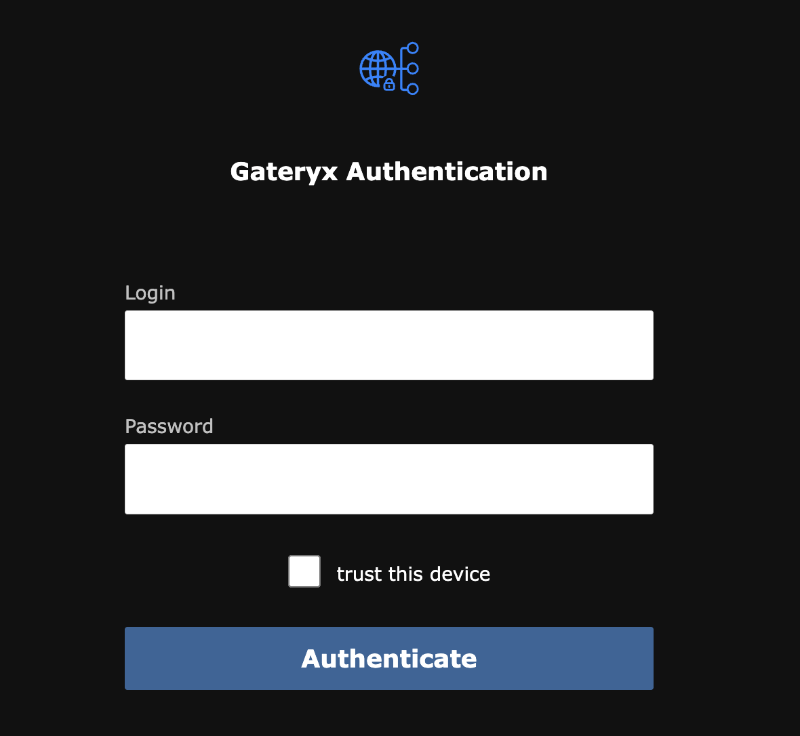
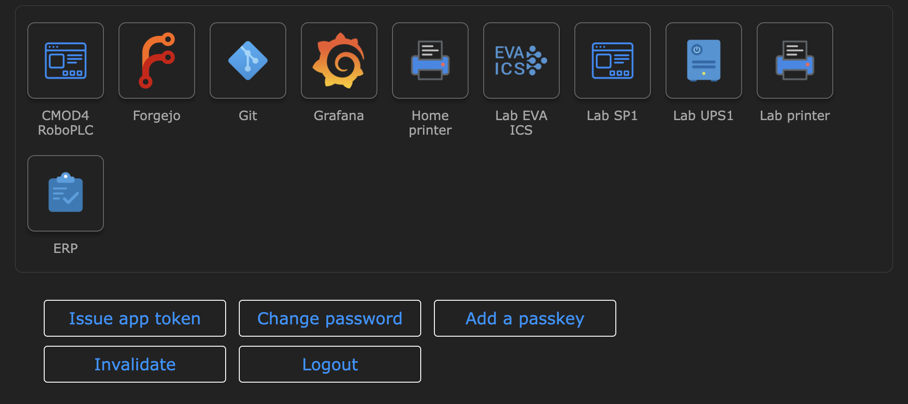

Usage
*****

.. contents::

Authentication
==============

If a user has no JWT token issued yet, Gateryx will redirect the user to the
internal authentication web app. The authentication form accepts both passwords
and passkeys if enrolled. The passkey selection is offered automatically by the
browser.

In case if the application group is deployed as `APP.domain`, the
authentication app works as a single-signon (SSO) point, no repeated login is
required until the token expires.

**Trust this device** mean to store the issued token in the browser's for the
all time it has been issued.

.. note::

   If a passkey is used for authentication, the device is considered trusted no
   matter if the checkbox is selected or not.

Web applications
================

The majority web applications work out-of-the box, no special
configuration/rules are required. Gateryx is designed to resolve problems
automatically, in case of any issues please contact the product support.

Certain web applications may require custom web socket settings to work
properly. Refer to :doc:`configuration <config>` for more details.

System application
==================

If the system application is configured, users can access it via
`https://gate.domain/` (or a custom subdomain if set).

The system application provides the web application list and a minimalistic
interface, which allows users to:

* Issue app token - issue a bearer JWT token for a selected application.

* Change password - works only if the authenticator is set to `db` (internal
  database).

* Add a passkey - available only for the application group of the same domain.

* Invalidate - invalidate all issued tokens for the user (WARNING: issued
  application tokens are also invalidated).

* Logout - terminates the session and removes the token from the browser.

Service users
=============

The command

.. code:: bash

    gateryx user create -r USERNAME

creates a service user. Service users can not use web applications directly
however can have application tokens issued.

Using application tokens
========================

An issued application token can be sent in the following ways:

* `Authorization: Bearer <token>` HTTP header.

* `Authorization: Basic <base64-encodeded-username:token>` HTTP header. The
  username part can be any string and is ignored.

In case if the target app requires own autnorization header, an alternative
header name can be specified (default: `X-Gateryx-Authorization`).

.. note::

   Certain clients (e.g. `git`) do not send authorization headers if the user
   name is empty. Consider using any non-empty string.

The command

.. code:: bash

   gareryx user issue-app-token -u USERNAME -a APP -x DAYS

Allows admin to issue application token for a service or regular user. The
token can be issued for `any` days, despite the limits are configured for
regular users.
