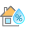
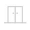
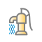
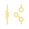
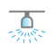
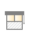

'/opt/eva-hmi-block_ui/themes/dark/btn/x_busy.svg' -> './themes/dark/btn/x_busy.svg'
'/opt/eva-hmi-block_ui/themes/dark/btn/x_macros.svg' -> './themes/dark/btn/x_macros.svg'
'/opt/eva-hmi-block_ui/themes/dark/btn/x_menu.svg' -> './themes/dark/btn/x_menu.svg'
'/opt/eva-hmi-block_ui/themes/dark/data_icons/hum.svg' -> './themes/dark/data_icons/hum.svg'
'/opt/eva-hmi-block_ui/themes/dark/data_icons/hum_in.svg' -> './themes/dark/data_icons/hum_in.svg'
'/opt/eva-hmi-block_ui/themes/dark/data_icons/hum_out.svg' -> './themes/dark/data_icons/hum_out.svg'
'/opt/eva-hmi-block_ui/themes/dark/data_icons/hum_soil.svg' -> './themes/dark/data_icons/hum_soil.svg'
'/opt/eva-hmi-block_ui/themes/dark/data_icons/in.svg' -> './themes/dark/data_icons/in.svg'
'/opt/eva-hmi-block_ui/themes/dark/data_icons/pressure.svg' -> './themes/dark/data_icons/pressure.svg'
'/opt/eva-hmi-block_ui/themes/dark/data_icons/pressure_out.svg' -> './themes/dark/data_icons/pressure_out.svg'
'/opt/eva-hmi-block_ui/themes/dark/data_icons/sun.svg' -> './themes/dark/data_icons/sun.svg'
'/opt/eva-hmi-block_ui/themes/dark/data_icons/sun_house.svg' -> './themes/dark/data_icons/sun_house.svg'
'/opt/eva-hmi-block_ui/themes/dark/data_icons/temp.svg' -> './themes/dark/data_icons/temp.svg'
'/opt/eva-hmi-block_ui/themes/dark/data_icons/temp_in.svg' -> './themes/dark/data_icons/temp_in.svg'
'/opt/eva-hmi-block_ui/themes/dark/data_icons/temp_out.svg' -> './themes/dark/data_icons/temp_out.svg'
'/opt/eva-hmi-block_ui/themes/dark/data_icons/temp_soil.svg' -> './themes/dark/data_icons/temp_soil.svg'
'/opt/eva-hmi-block_ui/themes/dark/icons.css' -> './themes/dark/icons.css'
'/opt/eva-hmi-block_ui/themes/dark/icons/_error.svg' -> './themes/dark/icons/_error.svg'
'/opt/eva-hmi-block_ui/themes/dark/icons/attn.off.svg' -> './themes/dark/icons/attn.off.svg'
'/opt/eva-hmi-block_ui/themes/dark/icons/attn.on.svg' -> './themes/dark/icons/attn.on.svg'
'/opt/eva-hmi-block_ui/themes/dark/icons/cam.off.svg' -> './themes/dark/icons/cam.off.svg'
'/opt/eva-hmi-block_ui/themes/dark/icons/cam.on.svg' -> './themes/dark/icons/cam.on.svg'
'/opt/eva-hmi-block_ui/themes/dark/icons/circle.blue.svg' -> './themes/dark/icons/circle.blue.svg'
'/opt/eva-hmi-block_ui/themes/dark/icons/circle.green.svg' -> './themes/dark/icons/circle.green.svg'
'/opt/eva-hmi-block_ui/themes/dark/icons/circle.grey.svg' -> './themes/dark/icons/circle.grey.svg'
'/opt/eva-hmi-block_ui/themes/dark/icons/circle.off.svg' -> './themes/dark/icons/circle.off.svg'
'/opt/eva-hmi-block_ui/themes/dark/icons/circle.random.svg' -> './themes/dark/icons/circle.random.svg'
'/opt/eva-hmi-block_ui/themes/dark/icons/circle.red.svg' -> './themes/dark/icons/circle.red.svg'
'/opt/eva-hmi-block_ui/themes/dark/icons/circle.white.svg' -> './themes/dark/icons/circle.white.svg'
'/opt/eva-hmi-block_ui/themes/dark/icons/circle.yellow.svg' -> './themes/dark/icons/circle.yellow.svg'
'/opt/eva-hmi-block_ui/themes/dark/icons/door.closed.svg' -> './themes/dark/icons/door.closed.svg'
'/opt/eva-hmi-block_ui/themes/dark/icons/door.open-full.svg' -> './themes/dark/icons/door.open-full.svg'
'/opt/eva-hmi-block_ui/themes/dark/icons/door.open.svg' -> './themes/dark/icons/door.open.svg'
'/opt/eva-hmi-block_ui/themes/dark/icons/door_left.closed.svg' -> './themes/dark/icons/door_left.closed.svg'
'/opt/eva-hmi-block_ui/themes/dark/icons/door_left.open-full.svg' -> './themes/dark/icons/door_left.open-full.svg'
'/opt/eva-hmi-block_ui/themes/dark/icons/door_left.open.svg' -> './themes/dark/icons/door_left.open.svg'
'/opt/eva-hmi-block_ui/themes/dark/icons/door_right.closed.svg' -> './themes/dark/icons/door_right.closed.svg'
'/opt/eva-hmi-block_ui/themes/dark/icons/door_right.open-full.svg' -> './themes/dark/icons/door_right.open-full.svg'
'/opt/eva-hmi-block_ui/themes/dark/icons/door_right.open.svg' -> './themes/dark/icons/door_right.open.svg'
'/opt/eva-hmi-block_ui/themes/dark/icons/enter.off.svg' -> './themes/dark/icons/enter.off.svg'
'/opt/eva-hmi-block_ui/themes/dark/icons/enter.on.svg' -> './themes/dark/icons/enter.on.svg'
'/opt/eva-hmi-block_ui/themes/dark/icons/error.svg' -> './themes/dark/icons/error.svg'
'/opt/eva-hmi-block_ui/themes/dark/icons/head.off.svg' -> './themes/dark/icons/head.off.svg'
'/opt/eva-hmi-block_ui/themes/dark/icons/head.on.svg' -> './themes/dark/icons/head.on.svg'
'/opt/eva-hmi-block_ui/themes/dark/icons/in.off.svg' -> './themes/dark/icons/in.off.svg'
'/opt/eva-hmi-block_ui/themes/dark/icons/in.on.svg' -> './themes/dark/icons/in.on.svg'
'/opt/eva-hmi-block_ui/themes/dark/icons/lamp.off.svg' -> './themes/dark/icons/lamp.off.svg'
'/opt/eva-hmi-block_ui/themes/dark/icons/lamp.on.svg' -> './themes/dark/icons/lamp.on.svg'
'/opt/eva-hmi-block_ui/themes/dark/icons/lamps.off.svg' -> './themes/dark/icons/lamps.off.svg'
'/opt/eva-hmi-block_ui/themes/dark/icons/lamps.on.svg' -> './themes/dark/icons/lamps.on.svg'
'/opt/eva-hmi-block_ui/themes/dark/icons/moon.off.svg' -> './themes/dark/icons/moon.off.svg'
'/opt/eva-hmi-block_ui/themes/dark/icons/moon.on.svg' -> './themes/dark/icons/moon.on.svg'
'/opt/eva-hmi-block_ui/themes/dark/icons/music.blue.svg' -> './themes/dark/icons/music.blue.svg'
'/opt/eva-hmi-block_ui/themes/dark/icons/music.green.svg' -> './themes/dark/icons/music.green.svg'
'/opt/eva-hmi-block_ui/themes/dark/icons/music.off.svg' -> './themes/dark/icons/music.off.svg'
'/opt/eva-hmi-block_ui/themes/dark/icons/music.red.svg' -> './themes/dark/icons/music.red.svg'
'/opt/eva-hmi-block_ui/themes/dark/icons/out.off.svg' -> './themes/dark/icons/out.off.svg'
'/opt/eva-hmi-block_ui/themes/dark/icons/out.on.svg' -> './themes/dark/icons/out.on.svg'
'/opt/eva-hmi-block_ui/themes/dark/icons/pc.off.svg' -> './themes/dark/icons/pc.off.svg'
'/opt/eva-hmi-block_ui/themes/dark/icons/pc.on.svg' -> './themes/dark/icons/pc.on.svg'
'/opt/eva-hmi-block_ui/themes/dark/icons/piano.off.svg' -> './themes/dark/icons/piano.off.svg'
'/opt/eva-hmi-block_ui/themes/dark/icons/piano.on.svg' -> './themes/dark/icons/piano.on.svg'
'/opt/eva-hmi-block_ui/themes/dark/icons/pump.off.svg' -> './themes/dark/icons/pump.off.svg'
'/opt/eva-hmi-block_ui/themes/dark/icons/pump.on.svg' -> './themes/dark/icons/pump.on.svg'
'/opt/eva-hmi-block_ui/themes/dark/icons/random.svg' -> './themes/dark/icons/random.svg'
'/opt/eva-hmi-block_ui/themes/dark/icons/relay.off.svg' -> './themes/dark/icons/relay.off.svg'
'/opt/eva-hmi-block_ui/themes/dark/icons/relay.on.svg' -> './themes/dark/icons/relay.on.svg'
'/opt/eva-hmi-block_ui/themes/dark/icons/reload.off.svg' -> './themes/dark/icons/reload.off.svg'
'/opt/eva-hmi-block_ui/themes/dark/icons/reload.on.svg' -> './themes/dark/icons/reload.on.svg'
'/opt/eva-hmi-block_ui/themes/dark/icons/snow.off.svg' -> './themes/dark/icons/snow.off.svg'
'/opt/eva-hmi-block_ui/themes/dark/icons/snow.on.svg' -> './themes/dark/icons/snow.on.svg'
'/opt/eva-hmi-block_ui/themes/dark/icons/sprinkler.off.svg' -> './themes/dark/icons/sprinkler.off.svg'
'/opt/eva-hmi-block_ui/themes/dark/icons/sprinkler.on.svg' -> './themes/dark/icons/sprinkler.on.svg'
'/opt/eva-hmi-block_ui/themes/dark/icons/star.blue.svg' -> './themes/dark/icons/star.blue.svg'
'/opt/eva-hmi-block_ui/themes/dark/icons/star.green.svg' -> './themes/dark/icons/star.green.svg'
'/opt/eva-hmi-block_ui/themes/dark/icons/star.grey.svg' -> './themes/dark/icons/star.grey.svg'
'/opt/eva-hmi-block_ui/themes/dark/icons/star.lightblue.svg' -> './themes/dark/icons/star.lightblue.svg'
'/opt/eva-hmi-block_ui/themes/dark/icons/star.off.svg' -> './themes/dark/icons/star.off.svg'
'/opt/eva-hmi-block_ui/themes/dark/icons/star.random.svg' -> './themes/dark/icons/star.random.svg'
'/opt/eva-hmi-block_ui/themes/dark/icons/star.red.svg' -> './themes/dark/icons/star.red.svg'
'/opt/eva-hmi-block_ui/themes/dark/icons/star.white.svg' -> './themes/dark/icons/star.white.svg'
'/opt/eva-hmi-block_ui/themes/dark/icons/star.yellow.svg' -> './themes/dark/icons/star.yellow.svg'
'/opt/eva-hmi-block_ui/themes/dark/icons/stop.off.svg' -> './themes/dark/icons/stop.off.svg'
'/opt/eva-hmi-block_ui/themes/dark/icons/stop.on.svg' -> './themes/dark/icons/stop.on.svg'
'/opt/eva-hmi-block_ui/themes/dark/icons/sun.off.svg' -> './themes/dark/icons/sun.off.svg'
'/opt/eva-hmi-block_ui/themes/dark/icons/sun.on.svg' -> './themes/dark/icons/sun.on.svg'
'/opt/eva-hmi-block_ui/themes/dark/icons/thermostat.off.svg' -> './themes/dark/icons/thermostat.off.svg'
'/opt/eva-hmi-block_ui/themes/dark/icons/thermostat.on.svg' -> './themes/dark/icons/thermostat.on.svg'
'/opt/eva-hmi-block_ui/themes/dark/icons/tv.off.svg' -> './themes/dark/icons/tv.off.svg'
'/opt/eva-hmi-block_ui/themes/dark/icons/tv.on.svg' -> './themes/dark/icons/tv.on.svg'
'/opt/eva-hmi-block_ui/themes/dark/icons/vent.off.svg' -> './themes/dark/icons/vent.off.svg'
'/opt/eva-hmi-block_ui/themes/dark/icons/vent.on.svg' -> './themes/dark/icons/vent.on.svg'
'/opt/eva-hmi-block_ui/themes/dark/icons/window_corner.closed.svg' -> './themes/dark/icons/window_corner.closed.svg'
'/opt/eva-hmi-block_ui/themes/dark/icons/window_corner.open.svg' -> './themes/dark/icons/window_corner.open.svg'
'/opt/eva-hmi-block_ui/themes/dark/icons/window_corner.raised.svg' -> './themes/dark/icons/window_corner.raised.svg'
'/opt/eva-hmi-block_ui/themes/dark/icons/window_left.closed.svg' -> './themes/dark/icons/window_left.closed.svg'
'/opt/eva-hmi-block_ui/themes/dark/icons/window_left.open.svg' -> './themes/dark/icons/window_left.open.svg'
'/opt/eva-hmi-block_ui/themes/dark/icons/window_left.raised.svg' -> './themes/dark/icons/window_left.raised.svg'
'/opt/eva-hmi-block_ui/themes/dark/icons/window_long.closed.svg' -> './themes/dark/icons/window_long.closed.svg'
'/opt/eva-hmi-block_ui/themes/dark/icons/window_long.open.svg' -> './themes/dark/icons/window_long.open.svg'
'/opt/eva-hmi-block_ui/themes/dark/icons/window_long.raised.svg' -> './themes/dark/icons/window_long.raised.svg'
'/opt/eva-hmi-block_ui/themes/dark/icons/window_right.closed.svg' -> './themes/dark/icons/window_right.closed.svg'
'/opt/eva-hmi-block_ui/themes/dark/icons/window_right.open.svg' -> './themes/dark/icons/window_right.open.svg'
'/opt/eva-hmi-block_ui/themes/dark/icons/window_right.raised.svg' -> './themes/dark/icons/window_right.raised.svg'
'/opt/eva-hmi-block_ui/themes/dark/icons/windows.closed.svg' -> './themes/dark/icons/windows.closed.svg'
'/opt/eva-hmi-block_ui/themes/dark/icons/windows.open.svg' -> './themes/dark/icons/windows.open.svg'
'/opt/eva-hmi-block_ui/themes/dark/icons/windows.raised.svg' -> './themes/dark/icons/windows.raised.svg'
'/opt/eva-hmi-block_ui/themes/dark/images/android_icon.svg' -> './themes/dark/images/android_icon.svg'
'/opt/eva-hmi-block_ui/themes/dark/images/cross.svg' -> './themes/dark/images/cross.svg'
'/opt/eva-hmi-block_ui/themes/dark/images/eva_logo.png' -> './themes/dark/images/eva_logo.png'
'/opt/eva-hmi-block_ui/themes/dark/images/patt.gif' -> './themes/dark/images/patt.gif'
'/opt/eva-hmi-block_ui/themes/dark/images/settings.png' -> './themes/dark/images/settings.png'
'/opt/eva-hmi-block_ui/themes/dark/menu_icons/exit.svg' -> './themes/dark/menu_icons/exit.svg'
'/opt/eva-hmi-block_ui/themes/dark/menu_icons/home.svg' -> './themes/dark/menu_icons/home.svg'
'/opt/eva-hmi-block_ui/themes/dark/menu_icons/phone.svg' -> './themes/dark/menu_icons/phone.svg'
'/opt/eva-hmi-block_ui/themes/dark/style.css' -> './themes/dark/style.css'
'/opt/eva-hmi-block_ui/themes/default/btn/x_busy.svg' -> './themes/default/btn/x_busy.svg'
'/opt/eva-hmi-block_ui/themes/default/btn/x_macros.svg' -> './themes/default/btn/x_macros.svg'
'/opt/eva-hmi-block_ui/themes/default/btn/x_menu.svg' -> './themes/default/btn/x_menu.svg'
'/opt/eva-hmi-block_ui/themes/default/data_icons/hum.svg' -> './themes/default/data_icons/hum.svg'
'/opt/eva-hmi-block_ui/themes/default/data_icons/hum_in.svg' -> './themes/default/data_icons/hum_in.svg'
'/opt/eva-hmi-block_ui/themes/default/data_icons/hum_out.svg' -> './themes/default/data_icons/hum_out.svg'
'/opt/eva-hmi-block_ui/themes/default/data_icons/hum_soil.svg' -> './themes/default/data_icons/hum_soil.svg'
'/opt/eva-hmi-block_ui/themes/default/data_icons/in.svg' -> './themes/default/data_icons/in.svg'
'/opt/eva-hmi-block_ui/themes/default/data_icons/pressure.svg' -> './themes/default/data_icons/pressure.svg'
'/opt/eva-hmi-block_ui/themes/default/data_icons/pressure_out.svg' -> './themes/default/data_icons/pressure_out.svg'
'/opt/eva-hmi-block_ui/themes/default/data_icons/sun.svg' -> './themes/default/data_icons/sun.svg'
'/opt/eva-hmi-block_ui/themes/default/data_icons/sun_house.svg' -> './themes/default/data_icons/sun_house.svg'
'/opt/eva-hmi-block_ui/themes/default/data_icons/temp.svg' -> './themes/default/data_icons/temp.svg'
'/opt/eva-hmi-block_ui/themes/default/data_icons/temp_in.svg' -> './themes/default/data_icons/temp_in.svg'
'/opt/eva-hmi-block_ui/themes/default/data_icons/temp_out.svg' -> './themes/default/data_icons/temp_out.svg'
'/opt/eva-hmi-block_ui/themes/default/data_icons/temp_soil.svg' -> './themes/default/data_icons/temp_soil.svg'
'/opt/eva-hmi-block_ui/themes/default/icons.css' -> './themes/default/icons.css'
'/opt/eva-hmi-block_ui/themes/default/icons/_error.svg' -> './themes/default/icons/_error.svg'
'/opt/eva-hmi-block_ui/themes/default/icons/attn.off.svg' -> './themes/default/icons/attn.off.svg'
'/opt/eva-hmi-block_ui/themes/default/icons/attn.on.svg' -> './themes/default/icons/attn.on.svg'
'/opt/eva-hmi-block_ui/themes/default/icons/cam.off.svg' -> './themes/default/icons/cam.off.svg'
'/opt/eva-hmi-block_ui/themes/default/icons/cam.on.svg' -> './themes/default/icons/cam.on.svg'
'/opt/eva-hmi-block_ui/themes/default/icons/circle.blue.svg' -> './themes/default/icons/circle.blue.svg'
'/opt/eva-hmi-block_ui/themes/default/icons/circle.green.svg' -> './themes/default/icons/circle.green.svg'
'/opt/eva-hmi-block_ui/themes/default/icons/circle.grey.svg' -> './themes/default/icons/circle.grey.svg'
'/opt/eva-hmi-block_ui/themes/default/icons/circle.random.svg' -> './themes/default/icons/circle.random.svg'
'/opt/eva-hmi-block_ui/themes/default/icons/circle.red.svg' -> './themes/default/icons/circle.red.svg'
'/opt/eva-hmi-block_ui/themes/default/icons/circle.white.svg' -> './themes/default/icons/circle.white.svg'
'/opt/eva-hmi-block_ui/themes/default/icons/circle.yellow.svg' -> './themes/default/icons/circle.yellow.svg'
'/opt/eva-hmi-block_ui/themes/default/icons/door.closed.svg' -> './themes/default/icons/door.closed.svg'
'/opt/eva-hmi-block_ui/themes/default/icons/door.open-full.svg' -> './themes/default/icons/door.open-full.svg'
'/opt/eva-hmi-block_ui/themes/default/icons/door.open.svg' -> './themes/default/icons/door.open.svg'
'/opt/eva-hmi-block_ui/themes/default/icons/door_left.closed.svg' -> './themes/default/icons/door_left.closed.svg'
'/opt/eva-hmi-block_ui/themes/default/icons/door_left.open-full.svg' -> './themes/default/icons/door_left.open-full.svg'
'/opt/eva-hmi-block_ui/themes/default/icons/door_left.open.svg' -> './themes/default/icons/door_left.open.svg'
'/opt/eva-hmi-block_ui/themes/default/icons/door_right.closed.svg' -> './themes/default/icons/door_right.closed.svg'
'/opt/eva-hmi-block_ui/themes/default/icons/door_right.open-full.svg' -> './themes/default/icons/door_right.open-full.svg'
'/opt/eva-hmi-block_ui/themes/default/icons/door_right.open.svg' -> './themes/default/icons/door_right.open.svg'
'/opt/eva-hmi-block_ui/themes/default/icons/enter.off.svg' -> './themes/default/icons/enter.off.svg'
'/opt/eva-hmi-block_ui/themes/default/icons/enter.on.svg' -> './themes/default/icons/enter.on.svg'
'/opt/eva-hmi-block_ui/themes/default/icons/head.off.svg' -> './themes/default/icons/head.off.svg'
'/opt/eva-hmi-block_ui/themes/default/icons/head.on.svg' -> './themes/default/icons/head.on.svg'
'/opt/eva-hmi-block_ui/themes/default/icons/in.off.svg' -> './themes/default/icons/in.off.svg'
'/opt/eva-hmi-block_ui/themes/default/icons/in.on.svg' -> './themes/default/icons/in.on.svg'
'/opt/eva-hmi-block_ui/themes/default/icons/lamp.off.svg' -> './themes/default/icons/lamp.off.svg'
'/opt/eva-hmi-block_ui/themes/default/icons/lamp.on.svg' -> './themes/default/icons/lamp.on.svg'
'/opt/eva-hmi-block_ui/themes/default/icons/lamps.off.svg' -> './themes/default/icons/lamps.off.svg'
'/opt/eva-hmi-block_ui/themes/default/icons/lamps.on.svg' -> './themes/default/icons/lamps.on.svg'
'/opt/eva-hmi-block_ui/themes/default/icons/moon.off.svg' -> './themes/default/icons/moon.off.svg'
'/opt/eva-hmi-block_ui/themes/default/icons/moon.on.svg' -> './themes/default/icons/moon.on.svg'
'/opt/eva-hmi-block_ui/themes/default/icons/music.blue.svg' -> './themes/default/icons/music.blue.svg'
'/opt/eva-hmi-block_ui/themes/default/icons/music.green.svg' -> './themes/default/icons/music.green.svg'
'/opt/eva-hmi-block_ui/themes/default/icons/music.off.svg' -> './themes/default/icons/music.off.svg'
'/opt/eva-hmi-block_ui/themes/default/icons/music.red.svg' -> './themes/default/icons/music.red.svg'
'/opt/eva-hmi-block_ui/themes/default/icons/out.off.svg' -> './themes/default/icons/out.off.svg'
'/opt/eva-hmi-block_ui/themes/default/icons/out.on.svg' -> './themes/default/icons/out.on.svg'
'/opt/eva-hmi-block_ui/themes/default/icons/pc.off.svg' -> './themes/default/icons/pc.off.svg'
'/opt/eva-hmi-block_ui/themes/default/icons/pc.on.svg' -> './themes/default/icons/pc.on.svg'
'/opt/eva-hmi-block_ui/themes/default/icons/piano.off.svg' -> './themes/default/icons/piano.off.svg'
'/opt/eva-hmi-block_ui/themes/default/icons/piano.on.svg' -> './themes/default/icons/piano.on.svg'
'/opt/eva-hmi-block_ui/themes/default/icons/pump.off.svg' -> './themes/default/icons/pump.off.svg'
'/opt/eva-hmi-block_ui/themes/default/icons/pump.on.svg' -> './themes/default/icons/pump.on.svg'
'/opt/eva-hmi-block_ui/themes/default/icons/random.svg' -> './themes/default/icons/random.svg'
'/opt/eva-hmi-block_ui/themes/default/icons/relay.off.svg' -> './themes/default/icons/relay.off.svg'
'/opt/eva-hmi-block_ui/themes/default/icons/relay.on.svg' -> './themes/default/icons/relay.on.svg'
'/opt/eva-hmi-block_ui/themes/default/icons/reload.off.svg' -> './themes/default/icons/reload.off.svg'
'/opt/eva-hmi-block_ui/themes/default/icons/reload.on.svg' -> './themes/default/icons/reload.on.svg'
'/opt/eva-hmi-block_ui/themes/default/icons/snow.off.svg' -> './themes/default/icons/snow.off.svg'
'/opt/eva-hmi-block_ui/themes/default/icons/snow.on.svg' -> './themes/default/icons/snow.on.svg'
'/opt/eva-hmi-block_ui/themes/default/icons/sprinkler.off.svg' -> './themes/default/icons/sprinkler.off.svg'
'/opt/eva-hmi-block_ui/themes/default/icons/sprinkler.on.svg' -> './themes/default/icons/sprinkler.on.svg'
'/opt/eva-hmi-block_ui/themes/default/icons/star.blue.svg' -> './themes/default/icons/star.blue.svg'
'/opt/eva-hmi-block_ui/themes/default/icons/star.green.svg' -> './themes/default/icons/star.green.svg'
'/opt/eva-hmi-block_ui/themes/default/icons/star.grey.svg' -> './themes/default/icons/star.grey.svg'
'/opt/eva-hmi-block_ui/themes/default/icons/star.lightblue.svg' -> './themes/default/icons/star.lightblue.svg'
'/opt/eva-hmi-block_ui/themes/default/icons/star.off.svg' -> './themes/default/icons/star.off.svg'
'/opt/eva-hmi-block_ui/themes/default/icons/star.random.svg' -> './themes/default/icons/star.random.svg'
'/opt/eva-hmi-block_ui/themes/default/icons/star.red.svg' -> './themes/default/icons/star.red.svg'
'/opt/eva-hmi-block_ui/themes/default/icons/star.white.svg' -> './themes/default/icons/star.white.svg'
'/opt/eva-hmi-block_ui/themes/default/icons/star.yellow.svg' -> './themes/default/icons/star.yellow.svg'
'/opt/eva-hmi-block_ui/themes/default/icons/stop.off.svg' -> './themes/default/icons/stop.off.svg'
'/opt/eva-hmi-block_ui/themes/default/icons/stop.on.svg' -> './themes/default/icons/stop.on.svg'
'/opt/eva-hmi-block_ui/themes/default/icons/sun.off.svg' -> './themes/default/icons/sun.off.svg'
'/opt/eva-hmi-block_ui/themes/default/icons/sun.on.svg' -> './themes/default/icons/sun.on.svg'
'/opt/eva-hmi-block_ui/themes/default/icons/thermostat.off.svg' -> './themes/default/icons/thermostat.off.svg'
'/opt/eva-hmi-block_ui/themes/default/icons/thermostat.on.svg' -> './themes/default/icons/thermostat.on.svg'
'/opt/eva-hmi-block_ui/themes/default/icons/tv.off.svg' -> './themes/default/icons/tv.off.svg'
'/opt/eva-hmi-block_ui/themes/default/icons/tv.on.svg' -> './themes/default/icons/tv.on.svg'
'/opt/eva-hmi-block_ui/themes/default/icons/vent.off.svg' -> './themes/default/icons/vent.off.svg'
'/opt/eva-hmi-block_ui/themes/default/icons/vent.on.svg' -> './themes/default/icons/vent.on.svg'
'/opt/eva-hmi-block_ui/themes/default/icons/window_corner.closed.svg' -> './themes/default/icons/window_corner.closed.svg'
'/opt/eva-hmi-block_ui/themes/default/icons/window_corner.open.svg' -> './themes/default/icons/window_corner.open.svg'
'/opt/eva-hmi-block_ui/themes/default/icons/window_corner.raised.svg' -> './themes/default/icons/window_corner.raised.svg'
'/opt/eva-hmi-block_ui/themes/default/icons/window_left.closed.svg' -> './themes/default/icons/window_left.closed.svg'
'/opt/eva-hmi-block_ui/themes/default/icons/window_left.open.svg' -> './themes/default/icons/window_left.open.svg'
'/opt/eva-hmi-block_ui/themes/default/icons/window_left.raised.svg' -> './themes/default/icons/window_left.raised.svg'
'/opt/eva-hmi-block_ui/themes/default/icons/window_long.closed.svg' -> './themes/default/icons/window_long.closed.svg'
'/opt/eva-hmi-block_ui/themes/default/icons/window_long.open.svg' -> './themes/default/icons/window_long.open.svg'
'/opt/eva-hmi-block_ui/themes/default/icons/window_long.raised.svg' -> './themes/default/icons/window_long.raised.svg'
'/opt/eva-hmi-block_ui/themes/default/icons/window_right.closed.svg' -> './themes/default/icons/window_right.closed.svg'
'/opt/eva-hmi-block_ui/themes/default/icons/window_right.open.svg' -> './themes/default/icons/window_right.open.svg'
'/opt/eva-hmi-block_ui/themes/default/icons/window_right.raised.svg' -> './themes/default/icons/window_right.raised.svg'
'/opt/eva-hmi-block_ui/themes/default/icons/windows.closed.svg' -> './themes/default/icons/windows.closed.svg'
'/opt/eva-hmi-block_ui/themes/default/icons/windows.open.svg' -> './themes/default/icons/windows.open.svg'
'/opt/eva-hmi-block_ui/themes/default/icons/windows.raised.svg' -> './themes/default/icons/windows.raised.svg'
'/opt/eva-hmi-block_ui/themes/default/images/android_icon.svg' -> './themes/default/images/android_icon.svg'
'/opt/eva-hmi-block_ui/themes/default/images/cross.svg' -> './themes/default/images/cross.svg'
'/opt/eva-hmi-block_ui/themes/default/images/eva_logo.png' -> './themes/default/images/eva_logo.png'
'/opt/eva-hmi-block_ui/themes/default/images/patt.gif' -> './themes/default/images/patt.gif'
'/opt/eva-hmi-block_ui/themes/default/images/settings.png' -> './themes/default/images/settings.png'
'/opt/eva-hmi-block_ui/themes/default/menu_icons/exit.svg' -> './themes/default/menu_icons/exit.svg'
'/opt/eva-hmi-block_ui/themes/default/menu_icons/exit_active.svg' -> './themes/default/menu_icons/exit_active.svg'
'/opt/eva-hmi-block_ui/themes/default/menu_icons/home.svg' -> './themes/default/menu_icons/home.svg'
'/opt/eva-hmi-block_ui/themes/default/menu_icons/home_active.svg' -> './themes/default/menu_icons/home_active.svg'
'/opt/eva-hmi-block_ui/themes/default/menu_icons/phone.svg' -> './themes/default/menu_icons/phone.svg'
'/opt/eva-hmi-block_ui/themes/default/menu_icons/phone_active.svg' -> './themes/default/menu_icons/phone_active.svg'
'/opt/eva-hmi-block_ui/themes/default/style.css' -> './themes/default/style.css'
Icons (default theme)
*********************

.. contents::

.. _data_icons:

Data icons
==========

+------------------+-----------------------+
| name             | icon                  |
+==================+=======================+
| hum              | |di_hum|              |
+------------------+-----------------------+
| in               | |di_in|               |
+------------------+-----------------------+
| indoor_hum       | |di_indoor_hum|       |
+------------------+-----------------------+
| indoor_temp      | |di_indoor_temp|      |
+------------------+-----------------------+
| outdoor_hum      | |di_outdoor_hum|      |
+------------------+-----------------------+
| outdoor_pressure | |di_outdoor_pressure| |
+------------------+-----------------------+
| outdoor_temp     | |di_outdoor_temp|     |
+------------------+-----------------------+
| pressure         | |di_pressure|         |
+------------------+-----------------------+
| soil_hum         | |di_soil_hum|         |
+------------------+-----------------------+
| soil_temp        | |di_soil_temp|        |
+------------------+-----------------------+
| sun              | |di_sun|              |
+------------------+-----------------------+
| sun_house        | |di_sun_house|        |
+------------------+-----------------------+
| temp             | |di_temp|             |
+------------------+-----------------------+

.. _state_icons:

State icons
===========

.. |si_cam.s_1| image:: themes/default/icons/cam.on.svg
  :width: 42px
  :align: middle

.. |si_lamps.s_0| image:: themes/default/icons/lamps.off.svg
  :width: 42px
  :align: middle

.. |si_out.s_0| image:: themes/default/icons/out.off.svg
  :width: 42px
  :align: middle

.. |si_star.s_0| image:: themes/default/icons/star.off.svg
  :width: 42px
  :align: middle

.. |si_window_corner.s_0| image:: themes/default/icons/window_corner.closed.svg
  :width: 42px
  :align: middle

.. |si_window_left.s_0| image:: themes/default/icons/window_left.closed.svg
  :width: 42px
  :align: middle

.. |si_window_left.s_1| image:: themes/default/icons/window_left.open.svg
  :width: 42px
  :align: middle

+-------------------------+-------------------------+-------------------------+-------------------------+
| name                    | s_0                     | s_1                     | s_2                     |
+=========================+=========================+=========================+=========================+
| attn                    | |si_attn.s_0|           | |si_attn.s_1|           |                         | 
+-------------------------+-------------------------+-------------------------+-------------------------+
| cam                     | |si_cam.s_0|            | |si_cam.s_1|            |                         | 
+-------------------------+-------------------------+-------------------------+-------------------------+
| circle                  | |si_circle.s_0|         | |si_circle.s_1|         |                         | 
+-------------------------+-------------------------+-------------------------+-------------------------+
| door                    | |si_door.s_0|           | |si_door.s_1|           | |si_door.s_2|           | 
+-------------------------+-------------------------+-------------------------+-------------------------+
| door_left               | |si_door_left.s_0|      | |si_door_left.s_1|      | |si_door_left.s_2|      | 
+-------------------------+-------------------------+-------------------------+-------------------------+
| door_right              | |si_door_right.s_0|     | |si_door_right.s_1|     | |si_door_right.s_2|     | 
+-------------------------+-------------------------+-------------------------+-------------------------+
| enter                   | |si_enter.s_0|          | |si_enter.s_1|          |                         | 
+-------------------------+-------------------------+-------------------------+-------------------------+
| head                    | |si_head.s_0|           | |si_head.s_1|           |                         | 
+-------------------------+-------------------------+-------------------------+-------------------------+
| lamp                    | |si_lamp.s_0|           | |si_lamp.s_1|           |                         | 
+-------------------------+-------------------------+-------------------------+-------------------------+
| lamps                   | |si_lamps.s_0|          | |si_lamps.s_1|          |                         | 
+-------------------------+-------------------------+-------------------------+-------------------------+
| moon                    | |si_moon.s_0|           | |si_moon.s_1|           |                         | 
+-------------------------+-------------------------+-------------------------+-------------------------+
| music                   | |si_music.s_0|          | |si_music.s_1|          |                         | 
+-------------------------+-------------------------+-------------------------+-------------------------+
| out                     | |si_out.s_0|            | |si_out.s_1|            |                         | 
+-------------------------+-------------------------+-------------------------+-------------------------+
| pc                      | |si_pc.s_0|             | |si_pc.s_1|             |                         | 
+-------------------------+-------------------------+-------------------------+-------------------------+
| piano                   | |si_piano.s_0|          | |si_piano.s_1|          |                         | 
+-------------------------+-------------------------+-------------------------+-------------------------+
| pump                    | |si_pump.s_0|           | |si_pump.s_1|           |                         | 
+-------------------------+-------------------------+-------------------------+-------------------------+
| relay                   | |si_relay.s_0|          | |si_relay.s_1|          |                         | 
+-------------------------+-------------------------+-------------------------+-------------------------+
| reload                  | |si_reload.s_0|         | |si_reload.s_1|         |                         | 
+-------------------------+-------------------------+-------------------------+-------------------------+
| snow                    | |si_snow.s_0|           | |si_snow.s_1|           |                         | 
+-------------------------+-------------------------+-------------------------+-------------------------+
| sprinkler               | |si_sprinkler.s_0|      | |si_sprinkler.s_1|      |                         | 
+-------------------------+-------------------------+-------------------------+-------------------------+
| star                    | |si_star.s_0|           | |si_star.s_1|           |                         | 
+-------------------------+-------------------------+-------------------------+-------------------------+
| stop                    | |si_stop.s_0|           | |si_stop.s_1|           |                         | 
+-------------------------+-------------------------+-------------------------+-------------------------+
| sun                     | |si_sun.s_0|            | |si_sun.s_1|            |                         | 
+-------------------------+-------------------------+-------------------------+-------------------------+
| thermostat              | |si_thermostat.s_0|     | |si_thermostat.s_1|     |                         | 
+-------------------------+-------------------------+-------------------------+-------------------------+
| tv                      | |si_tv.s_0|             | |si_tv.s_1|             |                         | 
+-------------------------+-------------------------+-------------------------+-------------------------+
| vent                    | |si_vent.s_0|           | |si_vent.s_1|           |                         | 
+-------------------------+-------------------------+-------------------------+-------------------------+
| window_corner           | |si_window_corner.s_0|  | |si_window_corner.s_1|  | |si_window_corner.s_2|  | 
+-------------------------+-------------------------+-------------------------+-------------------------+
| window_left             | |si_window_left.s_0|    | |si_window_left.s_1|    | |si_window_left.s_2|    | 
+-------------------------+-------------------------+-------------------------+-------------------------+
| window_long             | |si_window_long.s_0|    | |si_window_long.s_1|    | |si_window_long.s_2|    | 
+-------------------------+-------------------------+-------------------------+-------------------------+
| window_right            | |si_window_right.s_0|   | |si_window_right.s_1|   | |si_window_right.s_2|   | 
+-------------------------+-------------------------+-------------------------+-------------------------+
| windows                 | |si_windows.s_0|        | |si_windows.s_1|        | |si_windows.s_2|        | 
+-------------------------+-------------------------+-------------------------+-------------------------+

.. _special_state_icons:

Special state icons
===================

circle
------

+-------------------+------------------------+
| state             | icon                   |
+===================+========================+
| s_blue            | |spi_circle.s_blue|    |
+-------------------+------------------------+
| s_green           | |spi_circle.s_green|   |
+-------------------+------------------------+
| s_grey            | |spi_circle.s_grey|    |
+-------------------+------------------------+
| s_off             | |spi_circle.s_off|     |
+-------------------+------------------------+
| s_on              | |spi_circle.s_on|      |
+-------------------+------------------------+
| s_random          | |spi_circle.s_random|  |
+-------------------+------------------------+
| s_random2         | |spi_circle.s_random2| |
+-------------------+------------------------+
| s_red             | |spi_circle.s_red|     |
+-------------------+------------------------+
| s_white           | |spi_circle.s_white|   |
+-------------------+------------------------+
| s_yellow          | |spi_circle.s_yellow|  |
+-------------------+------------------------+

music
-----

.. |spi_music.s_green| image:: themes/default/icons/music.green.svg
  :width: 42px
  :align: middle

+----------------+---------------------+
| state          | icon                |
+================+=====================+
| s_blue         | |spi_music.s_blue|  |
+----------------+---------------------+
| s_green        | |spi_music.s_green| |
+----------------+---------------------+
| s_off          | |spi_music.s_off|   |
+----------------+---------------------+
| s_red          | |spi_music.s_red|   |
+----------------+---------------------+

star
----

.. |spi_star.s_music_green| image:: themes/default/icons/music.green.svg
  :width: 42px
  :align: middle

.. |spi_star.s_off| image:: themes/default/icons/star.off.svg
  :width: 42px
  :align: middle

+---------------------+--------------------------+
| state               | icon                     |
+=====================+==========================+
| s_blue              | |spi_star.s_blue|        |
+---------------------+--------------------------+
| s_green             | |spi_star.s_green|       |
+---------------------+--------------------------+
| s_grey              | |spi_star.s_grey|        |
+---------------------+--------------------------+
| s_music_blue        | |spi_star.s_music_blue|  |
+---------------------+--------------------------+
| s_music_green       | |spi_star.s_music_green| |
+---------------------+--------------------------+
| s_music_red         | |spi_star.s_music_red|   |
+---------------------+--------------------------+
| s_off               | |spi_star.s_off|         |
+---------------------+--------------------------+
| s_on                | |spi_star.s_on|          |
+---------------------+--------------------------+
| s_random            | |spi_star.s_random|      |
+---------------------+--------------------------+
| s_random2           | |spi_star.s_random2|     |
+---------------------+--------------------------+
| s_red               | |spi_star.s_red|         |
+---------------------+--------------------------+
| s_white             | |spi_star.s_white|       |
+---------------------+--------------------------+
| s_yellow            | |spi_star.s_yellow|      |
+---------------------+--------------------------+

