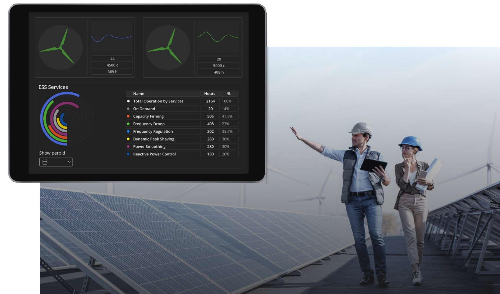

Bohemia Automation Information System
*************************************

This web site contains technical documentation for engineers.

More information about the products can be found at `Bohemia Automation web
site <https://www.bohemia-automation.com/>`_.

The provided articles can be used for self-support, development, training or
educational purposes without any restrictions.

.. toctree::
    :caption: Contents
    :maxdepth: 1

    eva4/index
    eva-mlkit/index
    eva-webengine/index
    eva-webengine-react/index
    evaics-app-grafana/index
    sim/index
    roboplc/index
    psrt/index
    gateryx/index
    busrt/index
    box/index
    common/index
    legacy
    trademarks

AI Agents Integration
=====================

`Bohemia Automation InfoSys <https://deepwiki.com/alttch/bma-info>`_ and SDK
libraries ara available for integration with AI agents via `DeepWiki MCP
<https://docs.devin.ai/work-with-devin/deepwiki-mcp>`_.

Warning: AI agents/AI indexers can make mistakes, supervision is strongly
recommended. For any controversial questions, refer to the official
documentation as the primary source.
