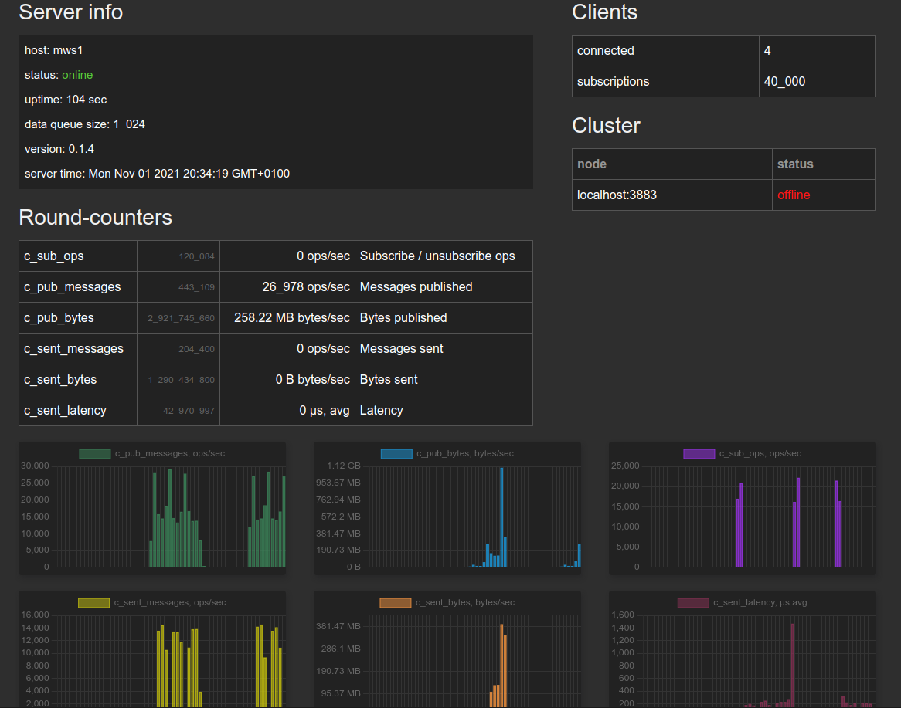
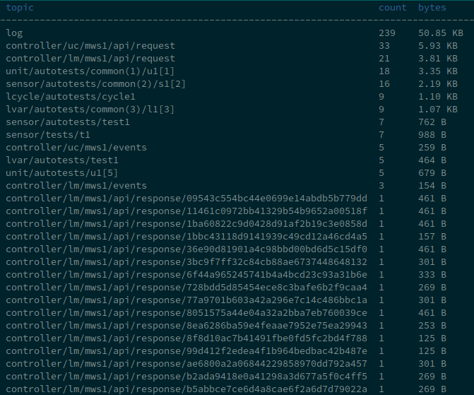

PSRT server and clients
***********************

.. contents::

Source code
===========

* Primary repository: https://github.com/alttch/psrt/
* Rust Cargo crate (the library and async client): https://crates.io/crates/psrt

Other repositories:

* `psrt-py <https://github.com/alttch/psrt-py>`_ - Python client library
  (sync), SDK is semi-compatible with `paho-mqtt
  <https://github.com/eclipse/paho.mqtt.python>`_.

Installation (free version)
===========================

Use binaries from https://github.com/alttch/psrt/releases. For Debian/Ubuntu
and other deb-based distributions, .deb packages can be used.

Building from source
--------------------

* Install `Rust <https://www.rust-lang.org/tools/install>`_
* Build the server and cli:

.. code:: shell

    git clone https://github.com/alttch/psrt/
    cd psrt
    cargo build --features server,cli --release

Configuration files
-------------------

If installed manually, get configuration files from
https://github.com/alttch/psrt/tree/main/make-deb/etc/psrtd or use files from
*test-configs* directory (need to be edited before use).

If installed from deb-package, configuration files are stored in */etc/psrtd*
directory.

The official port numbers, assigned by IANA for PSRT are 2873 TCP/UDP. It is
recommended to keep these ports on servers to let clients connect / push data
using defaults.

Troubleshooting
---------------

* If any problems occur, try running **psrtd** with *-v* argument to get
  verbose logging in terminal.

* The most common problem is timeout disconnect. The server timeout MUST be
  higher than the slowest expected client timeout.

Authentication
--------------

PSRT uses the standard *htpasswd* format, use any htpasswd-compatible tool
(with -B flag for bcrypt).

Passwords file and ACL can be reloaded on-the-flow. Use either *kill -HUP
$SERVER_PID* or *systemctl reload psrtd* (if systemd service is configured).

Statistical data
================

Overview (web interface / API)
------------------------------

Users with admin rights can obtain statistical data using a web browser (by
default, at http://localhost:8880).

The data can also be obtained in JSON for 3rd-party apps at:

.. code:: shell

    curl http://localhost:8880/status

If the anonymous user has no admin rights, URI requires login and password
(HTTP basic auth).

Most active topics
------------------

By executing **psrt-cli** with *--top* argument, the most active topics can be
monitored in console in real-time. Use "s" key to switch sorting between
message count and bytes.

UDP encryption
==============

PSRT supports symmetrical encrypted UDP frames (see the protocol
specifications). Currently supported encryption modes: AES128-GCM and
AES256-GCM.

To enable UDP encryption, add to "auth" section of the main config:

.. code:: yaml

    auth:
        # ........
        key_file: keys.yml

The keys file has the following format and there can be only one encryption key
per user:

.. code:: yaml

    user1: <aes_key>
    user2: <aes_key>

where aes\_key is a random 32-byte (for AES128 only first 16 bytes are used)
hex sequence, which can be generated, e.g. with:

.. code:: shell

    head -c16384 /dev/urandom|sha256sum|awk '{ print $1 }'

Enterprise version
==================

The following operating systems are recommended for production setups and
supported out-of-the-box:

* `Ubuntu Linux 20.04+ <https://ubuntu.com>`_
* `Debian GNU/Linux 11+ <https://www.debian.org>`_

Download packages from https://pub.bma.ai/psrt-enterprise/

The Enterprise version can be tested in "unlimited trial" mode. Feel free to
download testing `key files
<https://github.com/alttch/psrt/tree/main/enterprise-keys>`_. Each key file is
bound to the specific host name, so the system host names in "unlimited trial"
PSRT Enterprise clusters must be "node1", "node2" and "node3".
