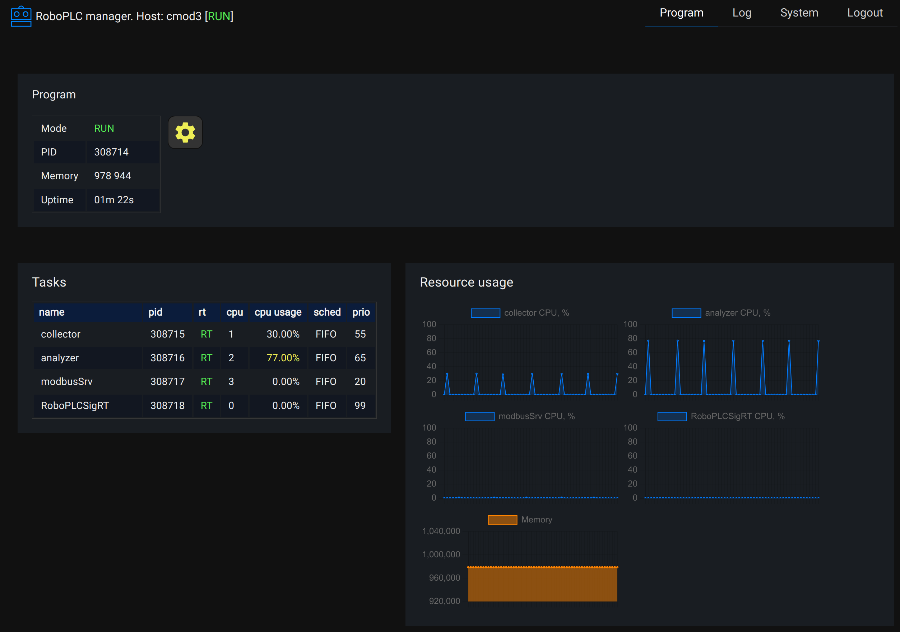
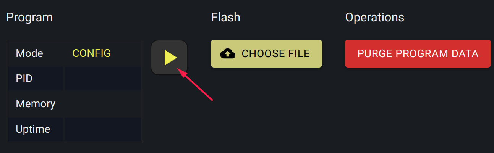
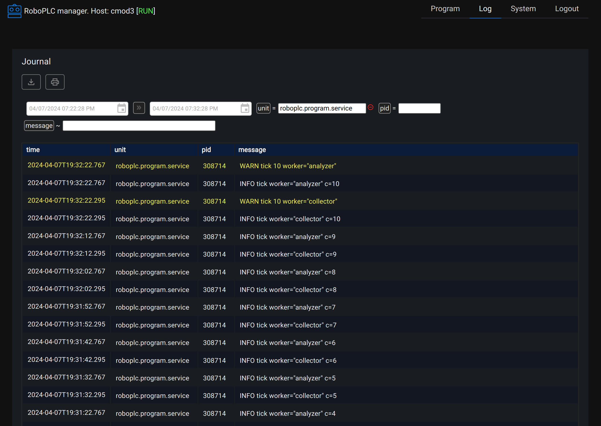
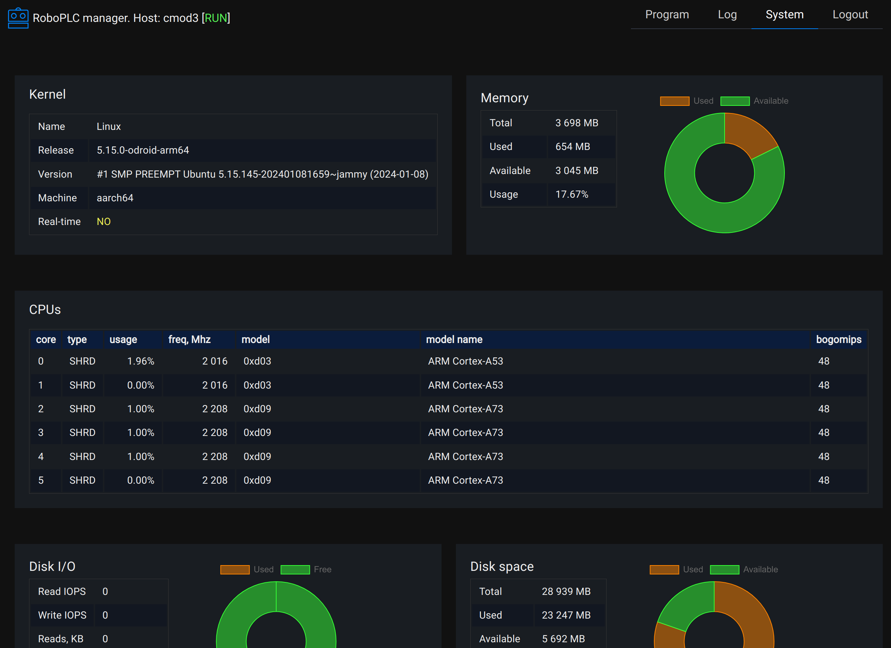

Configuring the system
**********************

.. contents::

.. _roboplc_manager:

RoboPLC Manager
===============

RoboPLC Manager is a server which provides a convenient way to manage RoboPLC
programs, monitor their states as well as the overall system state.

Installation
------------

Before installing RoboPLC Manager, read :doc:`manager_license`.

RoboPLC Manager is compatible with Debian, Ubuntu, Raspbian and other
Debian-based Linux distributions. Binaries are available for 64-bit x86 and
64-bit ARM architectures.

To install RoboPLC Manager, add the repository and install the package:

.. code:: shell

   curl https://pub.bma.ai/apt/setup | sudo sh
   sudo apt-get install roboplc-manager
   sudo systemctl start roboplc.manager

The Web UI is available by default at *http://IP:7700*. The default management key is *roboplc*.

The management key and other settings can be changed in the configuration file
*/etc/roboplc/manager.yml*. After modifying, the service must be restarted:

.. code:: shell

   sudo systemctl restart roboplc.manager

Layout
------

Modes
~~~~~

RoboPLC Manager brings the traditional PLC paradigm:

* There can be only one active program at a time.

* The host can be either in *CONFIG* or *RUN* state. When the host is in
  *CONFIG* state, the program can be modified (flashed). When in *RUN* state,
  the program is executed.

* Use the marked button to switch the host between *CONFIG* and *RUN* states.

* The button *Purge program data* is used to remove all data in
  */var/roboplc/data* folder (use with caution!).

Services and folders
~~~~~~~~~~~~~~~~~~~~

* RoboPLC Manager automatically enables and starts a systemd service named
  "roboplc.program"

* The program binary is stored in */var/roboplc/program*, the current binary is
  named "current".

* The program working directory is */var/roboplc/data*, where the program can
  store files, databases and other data, required to run.

* The program must be always compiled as a single binary file.

* The program is always started as root. It is highly recommended either
  keeping field-bus fully isolated (preferred) or dropping process privileges
  at some point.

Logging
~~~~~~~

The program must log to stdout, with no timestamps. The Rust method
`roboplc::configure_logger
<https://docs.rs/roboplc/latest/roboplc/fn.configure_logger.html>`_
automatically configures logger for that.

The log viewer is an interface for *journald* and can view logs from both the
program and other systemd services:

Uploading a program (flashing)
~~~~~~~~~~~~~~~~~~~~~~~~~~~~~~

A program binary can be uploaded either using the Web UI or *robo* CLI command
(see :doc:`flashing`).

Uninstalling RoboPLC Manager
----------------------------

To uninstall RoboPLC Manager, run:

.. code:: shell

   sudo apt-get remove roboplc-manager

Note that the program is not automatically stopped and the service is not
uninstalled. To stop the program and uninstall the service, run:

.. code:: shell

   sudo systemctl stop roboplc.program.service
   sudo systemctl disable roboplc.program.service
   rm -f /etc/systemd/system/roboplc.program.service
   systemctl daemon-reload

Kernel
======

It is highly recommended to switch the system to a real-time kernel. Consider
reviewing documentation for your distribution.

CPU isolation
=============

It is highly recommended to isolate CPUs for real-time program threads. To do
this, add the following kernel boot parameters:

.. code:: shell

   isolcpus=2,3,4

where 2,3,4 are CPU cores to isolate (starting from 0).

Memory allocation
=================

Memory allocation/deallocation operations can significantly slow down real-time
tasks. To resolve this, either avoid dynamically allocating/dropping variables
which use heap memory (maps, vectors, etc.) or use RoboPLC heap pre-allocation:

.. code:: rust

   roboplc::thread_rt::prealloc_heap(20_000_000).unwrap();

The above code pre-allocates 20 MB of heap memory plus prevents existing
process memory (after fixing, the pages are extended to 5-10 MB in total) from
being dropped.

The code needs to be executed once, at the beginning of the program.

IRQs
====

IRQs from devices can significantly slow down real-time tasks. To resolve this,
move IRQs to shared CPUs (not isolated) or disable the devices which are not
used.

Refer to the documentation for OS distribution and hardware for more details.

Troubleshooting
===============

Real-time thread parameters can not be set with "operation not permitted"
-------------------------------------------------------------------------

* Make sure the program is running with root privileges.

* Set */proc/sys/kernel/sched_rt_runtime_us* to *-1* either manually or using
  `RoboPLC SystemConfig
  <https://docs.rs/roboplc/latest/roboplc/thread_rt/struct.SystemConfig.html>`_:

.. code:: rust

   use roboplc::thread_rt::SystemConfig;

   let _sys = SystemConfig::new().set("kernel/sched_rt_runtime_us", -1)
       .apply()
       .expect("Unable to set system config");

Hardware
========

RoboPLC has been working on various hardware, from Raspberry Pi Zero to big
industrial machines.

* RoboPLC is designed to run on bare-metal Linux, with no virtualisation.

* It may be not the best idea to run RoboPLC programs in containers, unless you
  know what you are doing.

* Always remember that RoboPLC is a software, not a hardware. It can not do a
  miracle and turn $20-worth micro-computer into a high-performance industrial
  controller. Choose a proper hardware for your applications wisely.
