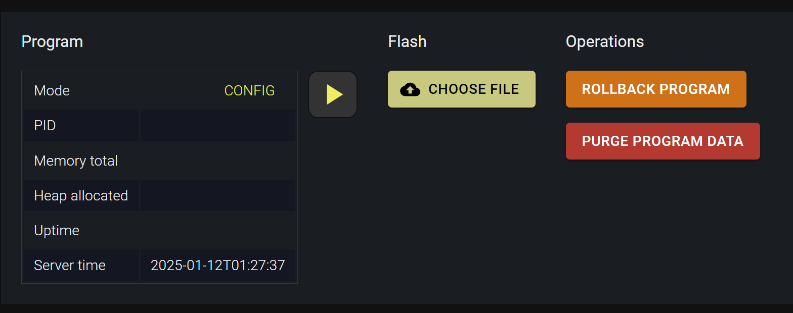

Flashing
********

.. contents::

If :ref:`roboplc_manager` is installed, it is possible to flash the program
remotely via either its web interface or using *robo* CLI program. Note that
the program can be flashed only when the host is in *CONFIG* mode.

.. note::

   RoboPLC Manager is not a mandatory component. The program can be
   uploaded/run using any custom method.

Installing RoboPLC CLI
======================

The *robo* CLI tool is available in cargo package *roboplc-cli*:

.. code:: shell

   cargo install roboplc-cli

The tool should be installed on the client machine, where the Rust project is
being developed. It is also possible to include the tool into CI/CD pipelines.

Configuring
===========

The program can be used with no configuration. In this case all options are
provided either via system variables *ROBOPLC_URL*, *ROBOPLC_KEY* or via
command-line arguments.

The priority is the following:

* Command-line arguments (higher)
* Environment variables
* Configuration file (lower)

Configuration file
------------------

.. note::

   When a new project is created with *robo new* command, it is possible to
   specify the remote url, key and timeout. If specified, the values are stored
   in the *robo.toml* file.

The file must be placed into the root directory of the project and named
*robo.toml*. If a project has no *Cargo.toml* or its present in a subfolder,
*robo.toml* from the current directory is used. The following options are
available:

.. code:: toml

    [remote]
    url = "http://IP_OR_HOST:7700"
    key = "roboplc"
    #timeout = 60

    [build]
    #cargo = "cargo"
    #target = "x86_64-unknown-linux-gnu"
    #cargo-args = "--some-extra --cargo-arguments"

    #[build.env]
    #DOCKER_OPTS = "-v /some/folder:/some/folder"

    [build-custom]
    #command = "some complex command to build"
    #file = "target file to upload"

* **remote.url** URL of the RoboPLC Manager (with no trailing slashes etc.)

* **remote.key** host management key

* **remote.timeout** max API timeout (keep it high enough for binary uploading)

* **build.cargo** cargo executable. If not specified, *cross* is used if
  present in the PATH, otherwise the compilation falls back to the default
  *cargo*

* **build.target** the remote target architecture. If not specified, the host
  architecture is tried to be detected automatically, using RoboPLC Manager API

* **build.env** additional environment variables for the build process. E.g. if
  certain crates are imported from local folders, specify `DOCKER_OPTS` to
  mount the folder into the container as: `DOCKER_OPTS = "-v
  /some/folder:/some/folder"`

.. warning::

   As the file contains the remote key, make sure it has got proper permissions
   and do not publish it to public source repositories.

Cross-compilation
=================

For cross compilation, it is recommended to install `cross
<https://github.com/cross-rs/cross>`_:

.. code:: shell

   cargo install cross

Custom compilation
==================

A completely custom compilation can be done using the following settings

.. code:: toml

    [build-custom]
    command = "some complex command to build"
    file = "target file to upload"

If *build-custom* section is present and *command* field is specified, *build*
section is ignored.

.. _roboplc_flash:

Flashing
========

The program can be flashed using the following command:

.. code:: shell

   robo flash

The program is automatically compiled for the remote target (release) and
uploaded to the remote host.

* use **\--run** (short: **-r**) option to automatically start the program
  after flashing

* use **\--force** (short: **-f**) option to switch the remote into *CONFIG*
  mode before flashing.

Debugging/testing
=================

The command

.. code:: shell

   robo x

Executes the program on the remote host in a virtual terminal and outputs the
result to the local console. This mode can be useful for debugging/testing
purposes.

.. note::

   The program does not capture the local console standard input on Microsoft
   Windows.

This mode also accepts additional command-line arguments, which are passed to
the program:

.. code:: shell

   robo x -- -a -b -c arg1 arg2

.. warning::

   It is not recommended to execute programs remotely on live production
   systems.

Switching between remotes
=========================

The file *robo.toml* contains the primary remote where the program is flashed.
Sometimes it is useful to switch between multiple remotes, e.g. to test the
program on different devices.

RoboPLC CLI allows to create a list of the remotes in a file named
*.robo-global.toml*. The file must be placed in the home directory of the user.

Example:

.. code:: toml

    [remote.system1]
    url = "http://192.168.20.200:7700"
    key = "secret1"

    [remote.other]
    url = "http://192.168.20.201:7700"
    key = "secret2"

When executing RoboPLC commands, specify the remote name instead of the URL,
e.g.:

.. code:: shell

   robo -U system1 stat
   robo -U system1 flash

.. warning::

   As the file contains remote keys, make sure it has got proper permissions.

.. _roboplc_rollback:

Program rollback
================

.. note::

   This feature requires :doc:`pro`.

To check the versions available, execute a command:

.. code:: shell

    robo stat --show-versions

The output is similar to:

.. code::

    Mode RUN
    PID  2016131
    Mem  66322432
    Up   2

    +---------+--------+---------------------------+
    | Program | Exists | Created                   |
    +---------+--------+---------------------------+
    | current | YES    | 2025-01-10T11:15:54+01:00 |
    +---------+--------+---------------------------+
    | prev.0  | YES    | 2025-01-10T11:05:44+01:00 |
    +---------+--------+---------------------------+

The system keeps a single previous version of the program, "current" is the
current active one, and "prev.0" is the previous one.

In case of a problem with the current program, it is possible to quickly roll
back to the previous:

.. code:: shell

    robo rollback

The command accepts the same flags as the *flash*: the rollback procedure can
be forced, without putting the system into *CONFIG* mode, the rolled back
program can be started automatically etc.

The rollback procedure can be also performed in RoboPLC Manager web interface.
To roll back using the web interface, the system must be in *CONFIG* mode.

.. warning::

    When a program is rolled back, the current version is replaced with the
    previous one. Backup of the current version is not performed.

.. _roboplc_live_updates:

Program live updates
====================

.. note::

   This feature requires :doc:`pro`.

Certain mission-critical configurations may require the system to be updated in
live mode, without stopping the program. When a live update is performed, the
program is not restarted with `systemd` but reloads its executable file. This
can save up to dozens, sometimes hundreds of milliseconds and minimize the
program downtime.

Live update is available for both :ref:`flashing <roboplc_flash>` and
:ref:`rollback <roboplc_rollback>` commands. Live update can be performed from
command-line only.

Preparing the program code to handle live updates
-------------------------------------------------

Despite the downtime is minimized as much as possible, the program starts from
the beginning, so it is important to :doc:`save the current state <state>`
before performing the live update.

Code example. Create a live update handler function:

.. code:: rust

   fn live_update_handler(
    context: &Context<Message, Variables>,
    ) -> roboplc::controller::HandlerResult {
        // get the persistent state lock
        let data = context.variables().persistent_data.lock();
        // save the state
        roboplc::state::save(STATE_FILE, &*data)?;
        // forget the lock to freeze all program workers during the live update
        // process
        std::mem::forget(data);
        // in case if an error is returned, the live update process is aborted
        Ok(())
    }

Instead of using `register_signals`, use `registers_signals_with_handlers
<https://docs.rs/roboplc/latest/roboplc/controller/struct.Controller.html#method.register_signals_with_handlers>`_
when launching the controller:

.. code:: rust

   controller.register_signals_with_handlers(|_| {}, live_update_handler, SHUTDOWN_TIMEOUT)?;
   controller.block();

Performing the live update
--------------------------

Execute `robo flash` or `robo rollback` with `--live` option:

.. code:: shell

    robo flash --live

* Options `--force` and `--run` are not required, as the system is assumed to
  be in *RUN* mode.

* In case if the program is not running, a regular flashing is performed, equal
  to `robo flash --force --run`.

.. warning::

    In rarely cases if the program fails to reload itself, it panics
    immediately. As there program file is overridden during the live update,
    the client must immediately execute either :ref:`rollback
    <roboplc_rollback>` or :ref:`flash <roboplc_flash>` (`\--force` option is
    recommended) to restore the previous working version.

    The client can also try running live update again, which is equal to
    flashing with the `\--force` and `\--run` options.

Technical details
-----------------

When the live update is performed, the current program file is forcibly
replaced, then the active program process receives `SIGUSR2` signal. The signal
immediately launches the live update handler function and in
case of no errors, calls `reload_executable
<https://docs.rs/roboplc/latest/roboplc/fn.reload_executable.html>`_ method.

The method determines the current program executable file and reloads it with
`execvp` system call.

Despite the live updates are supported by :doc:`pro` only, the feature is
technically available and still can be used in custom deployment environments
in the RoboPLC community edition.
