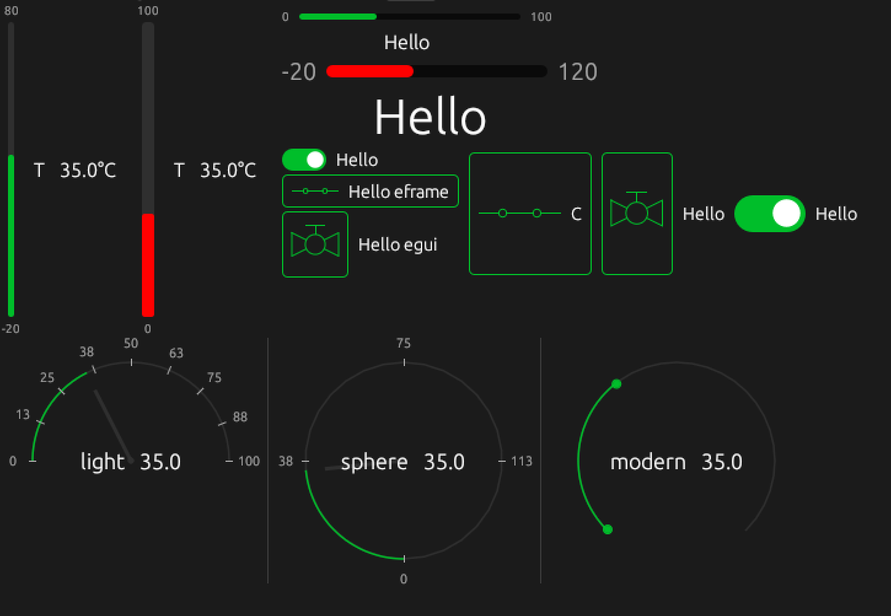

Human-Machine Interfaces
************************

In case if a RoboPLC program is running on a machine with a display, it can
communicate with the user through a Human-Machine Interface (HMI). The HMI can
be used to display information about the current state of the machine, as well
as to allow the user to interact with the machine by sending commands or
changing settings.

.. contents::

Text-based HMI
==============

Basics
------

Modify RoboPLC program service to let output to the primary TTY:

.. code:: shell

   sudo systemctl edit roboplc.program.service

Add the following lines:

.. code:: ini

   [Service]
   StandardOutput=console
   StandardError=journal
   TTYPath=/dev/tty1

After, any approach can be used, from simple print statements to more complex
console-based frameworks, such as `Cursive
<https://github.com/gyscos/cursive>`_, `Ratatui
<https://github.com/ratatui/ratatui>`_ or similar.

Displaying logs
---------------

Sometimes it is useful to display logs only. The default RoboPLC logger logs to
`stderr`, so modify the systemd `roboplc.program` service as the following:

.. code:: ini

   [Service]
   StandardError=console # or journal+console
   TTYPath=/dev/tty1

Add to `/etc/roboplc/program.env` the following line to enable date/time in
logs:

.. code:: ini

   ROBOPLC_LOG_STDOUT=1

After, `roboplc::configure_logger()
<https://docs.rs/roboplc/latest/roboplc/fn.configure_logger.html>`_ method
enables logging to the TTY with the detailed format.

Graphical HMI
=============

To output to a graphical interface, a X-server or Wayland compositor must be
running. After, any GUI framework can be used. RoboPLC also has got certain
tools to simplify this task in `HMI module
<https://docs.rs/roboplc/latest/roboplc/hmi/index.html>`_.

Wayland
-------

Wayland is a modern display server protocol that is designed to be simpler and
faster than X11. It is recommended to use Wayland for new GUI applications.

Installation
~~~~~~~~~~~~

It is recommended to use `weston <https://wayland.freedesktop.org/weston/>`_ as
a Wayland compositor. It is lightweight, fast and supported out-of-the-box:

.. code:: shell

   sudo apt-get -y install weston
   sudo apt-get -y install libgl1-mesa-glx # required for some older systems

Configuration
~~~~~~~~~~~~~~

Create a file `/etc/xdg/weston/weston.ini` with the following content:

.. code:: ini

   [core]
   # Disable everything except the main program output
   shell=kiosk-shell.so
   # Disable the screen saver
   idle-time=0

   [shell]
   locking=false
   panel-location=""
   panel-position=none

   # Configure the output
   [output]
   name=DP-1
   mode=1280x720@60.0

   # Optional: configure touchscreen if supported
   #[libinput]
   #touchscreen_calibrator=true
   #calibration_helper=/usr/bin/save-calibration.sh

In case if a touchscreen is used, create `/usr/bin/save-calibration.sh` file with the following content:

.. code:: shell

   #!/bin/bash

   echo 'SUBSYSTEM=="input", KERNEL=="event[0-9]*",
   ENV{ID_INPUT_TOUCHSCREEN}=="1",
   ENV{LIBINPUT_CALIBRATION_MATRIX}="'$2 $3 $4 $5 $6 $7'"' > /etc/udev/rules.d/touchscreen.rules

Do not forget to make it executable:

.. code:: shell

   sudo chmod +x /usr/bin/save-calibration.sh

After, when `weston` is running, start `weston-touch-calibrator` once to
calibrate the touchscreen. It is also useful to run the calibrator from HMI to
allow users to do re-calibration.

Usage
~~~~~

.. note::

   Do not forget to enable **hmi** feature of `roboplc` crate.

Create a dedicated RoboPLC worker which starts `weston` and then runs the GUI
application:

.. code:: rust

   use roboplc::hmi;

   // it is recommended to run the HMI worker on a dedicated CPU core with high
   // priority to make the UI as smooth as possible
   #[derive(WorkerOpts)]
   #[worker_opts(cpu = 1, priority = 90, scheduling = "fifo", blocking = true)]
   struct HmiWorker {}

   impl Worker<Message, Variables> for HmiWorker {
       fn run(&mut self, _context: &Context<Message, Variables>) -> WResult {
           hmi::start_server(
               hmi::ServerKind::Weston.options()
                   .with_kill_delay(Duration::from_secs(1))
                   .with_spawn_delay(Duration::from_secs(2)),
           );
           // Run the GUI application
           Ok(())
       }
   }

Add a line at the end of `main` function to stop `weston` when the program is
stopped:

.. code:: rust

   hmi::stop();

In case if an older `weston` version is used, use
`hmi::ServerKind::WestonLegacy
<https://docs.rs/roboplc/latest/roboplc/hmi/enum.ServerKind.html#variant.WestonLegacy>`_,
which automatically adds `\--tty=1` to the launch line.

It is also possible to use any custom display server, specifying
`hmi::ServerOptions
<https://docs.rs/roboplc/latest/roboplc/hmi/struct.ServerOptions.html>`_
manually. The server will be automatically started and
terminated.

See also a full code example:
https://github.com/roboplc/roboplc/blob/main/examples/hmi.rs

egui integration
~~~~~~~~~~~~~~~~

`egui <https://github.com/emilk/egui>`_ is a lightweight and fast GUI library
for Rust which has got additional seamless integration with RoboPLC. To use
`egui`-based HMI, start GUI as the following:

.. code:: rust

   use roboplc::hmi::{self, eframe, egui};

   #[derive(WorkerOpts)]
   #[worker_opts(cpu = 1, priority = 90, scheduling = "fifo", blocking = true)]
   struct HmiWorker {}

   impl Worker<Message, Variables> for HmiWorker {
       fn run(&mut self, context: &Context<Message, Variables>) -> WResult {
           roboplc::system::wait_running_state()?;
           loop {
               let mut opts = hmi::AppOptions::default();
               if roboplc::is_production() {
                   // For production - spawn Weston server
                   opts = opts.with_server_options(
                       hmi::ServerKind::Weston
                           .options()
                           .with_kill_delay(Duration::from_secs(2))
                           .with_spawn_delay(Duration::from_secs(2)),
                   );
               } else {
                   // For development - run windowed app with no server spawned
                   opts = opts.windowed();
               }
               if let Err(error) = hmi::run(MyHmiApp {}, context, opts) {
                   error!("HMI error: {}", error);
               }
               thread::sleep(Duration::from_secs(5));
           }
       }
   }

   struct MyHmiApp {}

   // The application is basically equal to a typical egui app, the only difference is that the update
   // function gets the controller context as an argument.
   impl hmi::App for MyHmiApp {
       type M = Message;
       type V = Variables;

       fn update(
           &mut self,
           ctx: &egui::Context,
           frame: &mut eframe::Frame,
           plc_context: &Context<Self::M, Self::V>,
       ) {
       // Draw the GUI here
       }
   }

The `hmi::App <https://docs.rs/roboplc/latest/roboplc/hmi/trait.App.html>`_
trait is an extension of `egui::App` trait to provide access to
PLC context without a need to pass it through the UI structure manually.

Creating HMI elements
~~~~~~~~~~~~~~~~~~~~~

It is recommended to use `ehmi <https://docs.rs/ehmi/latest/ehmi/index.html>`_
crate which is a part of RoboPLC ecosystem. It provides a set of widgets for
typical HMI applications.

Handling special keys
~~~~~~~~~~~~~~~~~~~~~

Certain special keys can not be handled by UI frameworks properly. RoboPLC
provides a feature **input-events**, which allows to easily handle any global
keystrokes.

An example of handling `Sleep` key is shown below:

.. code:: rust

    #[derive(WorkerOpts)]
    #[worker_opts(cpu = 3, priority = 50, scheduling = "fifo", blocking = true)]
    struct KeyHandler {}

    impl Worker<Message, Variables> for KeyHandler {
        fn run(&mut self, context: &Context<Message, Variables>) -> WResult {
            let mut sleep_pressed_at: Option<Monotonic> = None;
            for key in roboplc::io::keyboard::GlobalKeyListener::create(&[
                roboplc::io::keyboard::KeyCode::KEY_SLEEP,
            ])? {
                if key.code() == roboplc::io::keyboard::KeyCode::KEY_SLEEP {
                    match key.state() {
                        roboplc::io::keyboard::KeyState::Pressed => {
                            sleep_pressed_at = Some(key.time());
                        }
                        roboplc::io::keyboard::KeyState::Released => {
                            if let Some(pressed_at) = sleep_pressed_at {
                                if key.time() - pressed_at > Duration::from_secs(1) {
                                    info!("Sleep pressed");
                                    // perform some action
                                }
                            }
                        }
                        _ => {}
                    }
                }
            }
            Ok(())
        }
    }

X-server
--------

X11 server is a legacy system for managing graphical displays on Unix-like
operating systems.

Installation
~~~~~~~~~~~~

.. code:: shell

   sudo apt-get -y install xserver-xorg libxi6 libxkbcommon-x11-0

Configuration
~~~~~~~~~~~~~

Create the file `/etc/X11/xorg.conf.d/10-monitor.conf`, set the resolution etc.

.. code:: ini

   Section "Monitor"
    Identifier "DP-1"
    Option "PreferredMode" "1280x720"
   EndSection

Usage
~~~~~

Use `hmi::start_server
<https://docs.rs/roboplc/latest/roboplc/hmi/fn.start_server.html>`_ or
`hmi::run <https://docs.rs/roboplc/latest/roboplc/hmi/fn.run.html>`_ methods
with `hmi::ServerKind::Xorg
<https://docs.rs/roboplc/latest/roboplc/hmi/enum.ServerKind.html#variant.Xorg>`_
` server type.

Trobleshooting
==============

In case if the GUI server is unable to start:

* Check the server logs. If launched by the program, the logs are written to
  `roboplc.program` logs.

* Certain embedded systems may require higher spawn/kill delays to let the TTY
  switch to the graphical mode and back.

* Make sure there is no other graphical server running on the same TTY.

* Ensure the `roboplc.program` service
  (`/lib/systemd/system/roboplc.program.service`) has got `RuntimeDirectory`
  configured:

.. code:: ini

   [Service]
   # ..
   RuntimeDirectory=roboplc
   RuntimeDirectoryMode=700
