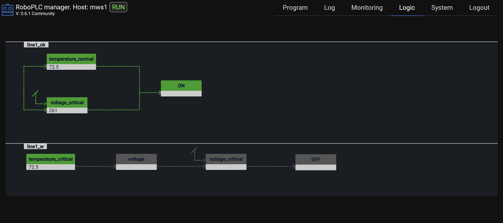
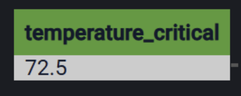
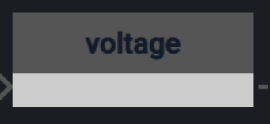
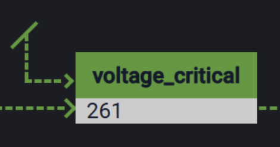
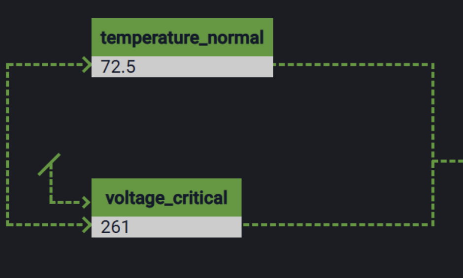

Logic lines
***********

RoboPLC re-exports `Logic Line <https://docs.rs/logicline/>`_ crate which is
a part of RoboPLC project.

Logic Line is a logic processing engine that combines the best of both worlds.
Inspired by `Ladder Logic <https://en.wikipedia.org/wiki/Ladder_logic>`_,
`Monads <https://en.wikipedia.org/wiki/Monad_(functional_programming)>`_ and
some others, it allows to write chains of logic rules as a regular Rust code,
but provides built-in tools for state recording, debugging and visualization.

.. note::

   To work with logic lines, enable roboplc crate **logicline** feature.

.. contents::

Working with logic lines
========================

The logic state recording is disabled by default, to enable it, use:

.. code:: rust

   roboplc::logicline::global::set_recording(true);

Processing logic:

.. code:: rust

   use roboplc::logicline;
   use rtsc::time::interval;

   // Create a logic processor per thread
   let mut processor = logicline::global::processor();
   let mut system_on = false;
   for _ in interval(Duration::from_millis(100)) {
       processor
           .line("line1_ok", sensors.temperature.as_f64())
           .then_any(
               action!(temperature_normal),
               action!("voltage_critical", |_| {
                   not(voltage_critical(sensors.voltage.as_f64()))
               })
           )
           .then(action!("ON", |()| {
               system_on = true;
               Some(())
           }));
       processor
           .line("line1_w", sensors.temperature.as_f64())
           .then(action!(temperature_critical))
           .then(action!("voltage", |()| Some(sensors.voltage.as_f64())))
           .then(action!(voltage_critical).with_recorded_input(&sensors.voltage.as_f64()))
           .then(action!("OFF", |()| {
               system_on = false;
               Some(())
           }));
       logicline::global::ingress(&mut processor);
       // process system_on variable, by synchronizing it with global program
       // context or sending new value directly to equipment

Refer to the `Logic Line documentation <https://docs.rs/logicline/>`_ for more details.

.. note::

   In production consider introducing API to switch the recording on for
   debugging or controling purposes, then switch it off when not required.

Exporting logic lines
=====================

`Logic Line` provides several ways to expose global project state:

.. code:: rust

   // listen on 0.0.0.0:9001
   roboplc::logicline::global::install_exporter()?;

The above example starts an HTTP server on the default address 0.0.0.0:9001
To start the server on a different address, refer to
`logic line <https://docs.rs/logicline/>`_ crate documentation.

.. warning::

   If the logic contains sensitive data, the access to the exporter server
   should be restricted, as an option, the server can be available for the
   local host only:

   .. code:: rust

       roboplc::logicline::global::install_exporter_on("127.0.0.1:9001").unwrap();

Viewing logic lines
===================

If :ref:`roboplc_manager` is used, the logic lines global state can be viewed
in its interface. The program logic lines exporter must be available on the
host at the address *http://127.0.0.1:9001*.

The `Logic Line` crate also provides built-in UI, which can be enabled by:

.. code:: shell

   cargo add logicline --features exporter-ui

When `exporter-ui` feature is enabled, the default interface is available at
*http://HOST:9001*.

Schema notation
---------------

Active block:

Inactive block:

A block with external input:

Logical OR:

