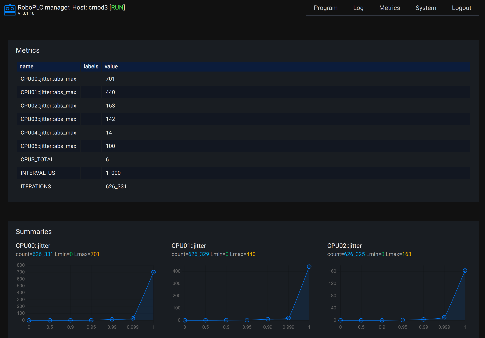

Metrics
*******

RoboPLC re-exports `Metrics <https://docs.rs/metrics/>`_ crate which is
recommended to expose metrics from the program.

.. note::

   To work with metrics, enable roboplc crate **metrics** feature.

Working with metrics
====================

The crate provides several kinds of metrics:

* Counter (an integer value that can only increase)
* Gauge (a floating point value)
* Histogram

Example:

.. code:: rust

   use roboplc::prelude::*;
   use roboplc::metrics::{counter, gauge, histogram};

   let mut prev = None;
   // a counter
   let c1 = counter!("worker::counter");
   // a counter with a label
   let c2 = counter!("worker::counter", "incr" => "2");
   // a gauge
   let g = gauge!("worker::value");
   // a histogram
   let h = histogram!("worker");
   for _ in roboplc::time::interval(step) {
       c1.increment(1);
       c2.increment(2);
       g.set(123);
       let now = Monotonic::now();
       if let Some(prev) = prev {
           h.record(now.duration_since(prev).as_micros() as f64);
       }
       prev.replace(now);
   }

Refer to the `Metrics documentation <https://docs.rs/metrics/>`_ for more details.

.. note::

   Metrics should not be used to export production data. Use a proper fieldbus
   protocol for that. Metrics are useful for program debugging and monitoring
   purposes only.

Exporting metrics
=================

The Metrics project provides several ways to expose metrics. RoboPLC re-exports
`metrics-exporter-prometheus <https://docs.rs/metrics-exporter-prometheus/>`_
builder:

.. code:: rust

   // listen on 0.0.0.0:9000
   roboplc::metrics_exporter()
      .set_bucket_duration(Duration::from_secs(600)).unwrap()
      .install().unwrap();

The above example starts an HTTP server on the default address 0.0.0.0:9000
with bucket time-to-live of 600 seconds. To start the server on a different
address, refer to `metrics_exporter_prometheus
<https://docs.rs/metrics-exporter-prometheus/>`_ crate documentation.

.. warning::

   If the metrics contain sensitive data, the access to the metrics server
   should be restricted, as an option, the server can be available for the
   local host only:

   .. code:: rust

       roboplc::metrics_exporter()
           .with_http_listener("127.0.0.1:9000".parse::<std::net::SocketAddr>().unwrap())
           .set_bucket_duration(Duration::from_secs(600)).unwrap()
           .install().unwrap();

Viewing metrics
===============

If :ref:`roboplc_manager` is used, the metrics can be viewed in its interface.
The program metrics must be available on the host at the address
*http://127.0.0.1:9000*.

The viewer supports histograms exported as summaries with quantiles only. The
metrics can be also viewed in any Prometheus-compatible monitoring system.
