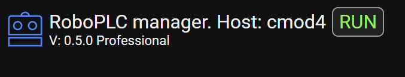

RoboPLC Professional
********************

.. contents::

RoboPLC Professional unlocks additional features and capabilities in RoboPLC.

Purchasing license
==================

A license must be purchased for each host that RoboPLC Manager is installed on.
All the licenses are perpetual and do not expire. A license allows to get
updates during at least 12 calendar months from the purchase date.

To purchase a license, visit `Bohemia Automation web site
<https://www.bohemia-automation.com>`_ to check the actual prices and contact
the product vendor about the details.

Getting a free license
======================

RoboPLC Professional licenses can be obtained for free for:

* Educational purposes (both for students and teachers)

* Open-source non-commercial projects

* Startup companies (less than 1 year old, up to 5 employees)

Please `contact Bohemia Automation
<https://www.bohemia-automation.com/contacts/>`_  for more information.

Features included
=================

* :ref:`roboplc_live_updates`

* :ref:`roboplc_rollback`

* Priority commercial support

Installing a license
====================

To install a license, upload the product key file to the target host, e.g. to
`/etc/roboplc/license.key`.

Edit `/etc/roboplc/manager.toml` and add a line in the "general" section:

.. code:: toml

   [general]
   # ...
   license_file = "/etc/roboplc/roboplc.key"

The file path must be absolute. Restart the RoboPLC Manager:

.. code:: bash

   sudo systemctl restart roboplc.manager

if the license is applied successfully, the following message is displayed in
RoboPLC Manager:

and "RoboPLC Pro License check passed" is printed to the manager service log file. In case of any issues, check the manager service log file for more details:

.. code:: bash

   sudo journalctl -u roboplc.manager

