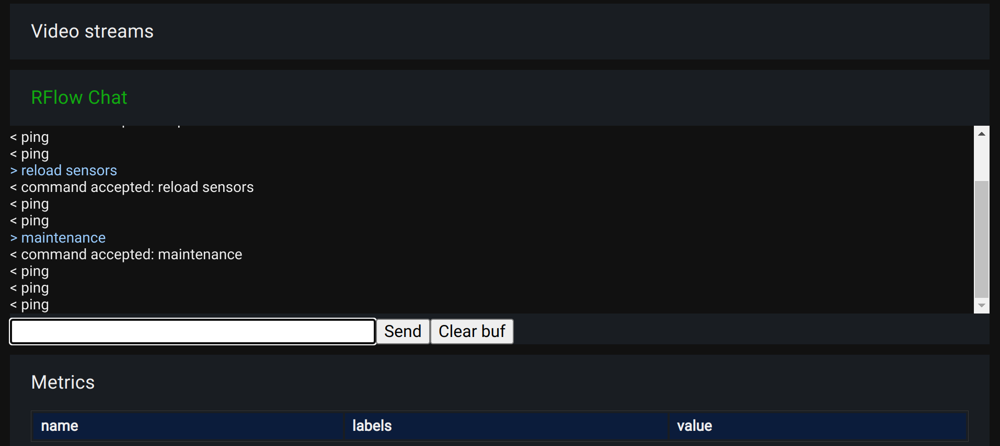

RFlow chat
**********

RoboPLC re-exports `RVideo <https://docs.rs/rrflow/>`_ crate which allows to
create a chat-line HMI for debugging, testing or production purposes.

.. note::

   To work with rflow, enable roboplc crate **rflow** feature.

Working with RFlow
==================

RFlow provides a simple chat interface to interact with the running RoboPLC program.
No any special interface is required, the defined chat can be connected either
with `rrflow-view <https://crates.io/crates/rflow-chat>`_, with
:ref:`roboplc_manager` or with a raw TCP client (e.g. `netcat` or `telnet`).

The chat can be used to obtain various diagnostic information, send commands to
the PLC etc.

Example:

.. code:: rust

    use roboplc::controller::prelude::*;
    use roboplc::prelude::*;

    const SHUTDOWN_TIMEOUT: Duration = Duration::from_secs(5);

    type Message = ();
    type Variables = ();

    #[derive(WorkerOpts)]
    #[worker_opts(cpu = 3, priority = 50, scheduling = "fifo", blocking = true)]
    struct Worker1 {}

    impl Worker<Message, Variables> for Worker1 {
        fn run(&mut self, _context: &Context<Message, Variables>) -> WResult {
            for command in roboplc::rflow::take_data_channel()? {
                match command.trim_end() {
                    "on" => todo!(),
                    "off" => todo!(),
                    v => roboplc::rflow::send(format!("command unknown: {v}")),
                }
            }
            Ok(())
        }
    }

    #[derive(WorkerOpts)]
    #[worker_opts(cpu = 3, priority = 50, scheduling = "fifo", blocking = true)]
    struct RflowSrv {}

    impl Worker<Message, Variables> for RflowSrv {
        fn run(&mut self, _context: &Context<Message, Variables>) -> WResult {
            // Listen on 0.0.0.0:4001
            roboplc::serve_rflow().map_err(Into::into)
        }
    }

    fn main() -> Result<(), Box<dyn std::error::Error>> {
        roboplc::setup_panic();
        roboplc::configure_logger(roboplc::LevelFilter::Info);
        if !roboplc::is_production() {
            roboplc::thread_rt::set_simulated();
        }
        roboplc::thread_rt::prealloc_heap(10_000_000)?;
        let mut controller = Controller::<Message, Variables>::new();
        controller.spawn_worker(RflowSrv {})?;
        controller.spawn_worker(Worker1 {})?;
        controller.register_signals(SHUTDOWN_TIMEOUT)?;
        controller.block();
        Ok(())
    }

Refer to the `RFlow documentation <https://docs.rs/rflow/>`_ for more details.

.. warning::

    By default the chat server is exposed to the network with no
    authentication, if the chat is programmed to input/output
    sensitive data, it should be restricted to the local host only:

    .. code:: rust

        roboplc::rflow::serve("127.0.0.1:4001").map_err(Into::into)

RFlow chat interface in RoboPLC manager
=======================================

If :ref:`roboplc_manager` is used, the chat can be used from its interface.
RFlow server must listen at the TCP port *127.0.0.1:4001*.

