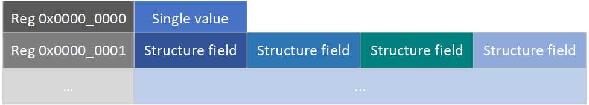
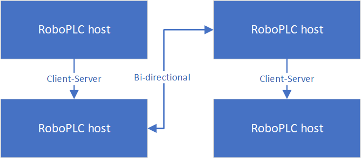

RoboPLC Data Objects (RPDO)
***************************

RoboPLC Data Objects Protocol is a lightweight fieldbus data exchange protocol,
inspired by Modbus, OPC-UA, TwinCAT/ADS and others.

The goal is to keep the protocol as simple as possible and fit the whole
specification in a single page. The protocol defines data exchange format only
and does not define any transport or security, it can be implemented in any
useful way.

.. contents::

Host
====

Host is a process which supports RPDO communication. The Host supports commands:

* `Ping` - check if the Host is alive
* `ReadShaeredContext` - read shared context data
* `WriteSharedContext` - write shared context data
* `WriteSharedContextUnconfirmed` - write shared context data without sending a
  confirmation reply

The host may support custom commands which allows to build a custom RPC.

The host has an unique address, which is a 32-bit unsigned integer. As the
address is always encoded into 32-bit integer, there is no definition how 
it must be specified/displayed in a particular implementation, it can be a
decimal number, a hex number, a 4-octet label (like IPv4 address) or as a
string.

Context
=======

Context is a memory area, divided into slots - registers. The register address
is a 32-bit unsigned integer. The context can be accessible by both local Host
and remotes.

As the register address is always encoded into 32-bit integer, there is no
definition how it must be specified/displayed in a particular implementation.

The implementation must provide a way to read/write register partially,
starting from a specified offset.

The implementation may provide a flexible context, which is automatically
resized when a new register is written.

The implementation may provide a flexible register size, which is automatically
adjusted when a larger value is written.

The register value is always a byte array, there are no data types and
serialization schemes. The parts must agree on the data format in the
particular project. A single register may contain multiple values, organized in
structures, the parts may read and write particular fields using data offsets
and sizes.

Communication
=============

The protocol supports bi-directional communication, when the sides can both
send and receive messages.

A particular implementation may provide multi-layer communication, where a
target is routed through the intermediate Hosts.

Transport and security
======================

The protocol does not define any particular transport, packets may be sent over
TCP/IP, RS232, RS485 or any other compatible transport, including Pub/Sub
servers.

The minimal packet size is 26 bytes, a packet with data is 38-bytes plus the
data size. A particular implementation must take this into account and choose a
proper transport which can carry packets of the required size. The practical
data amount in a single packet is limited to UINT32_MAX - 38 bytes.

A particular implementation may provide a secure transport, including packet
encryption, signing or TLS layer for TCP/IP.

Implementations
===============

Rust
----

The Rust implementation is provided by `rpdo <https://crates.io/crates/rpdo>`_
crate and supports the following features:

* A context with fixed register number

* Register size can be fixed or flexible

* The crate provides TCP and UDP (client-server only) transport.

Technical details
=================

.. note::

   The protocol uses little-endian byte order unless otherwise specified.

Packet
------

The data is exchanged in packets. The packet header is a 7-byte binary
structure with fields:

* `Magic` - 2 bytes, always `RD`
* `Version` - 1 byte, currently `0`
* `Size` - 4 bytes, 32-bit unsigned integer, the size of the following data

Frame
-----

The packet always contains a single frame.

The frame header is 19-byte binary structure with fields:

* `Source` - 4 bytes, 32-bit unsigned integer, the source address
* `Target` - 4 bytes, 32-bit unsigned integer, the target address
* `Id` - 4 bytes, 32-bit unsigned integer, the frame identifier, set by the source
* `InReplyTo` - 4 bytes, 32-bit unsigned integer, set for replies only, the
  identifier of the frame which is replied to, other frames must have it set to
  `0`
* `Command` - 2 bytes, 16-bit unsigned integer, the command code

Commands
--------

The standard commands are defined as:

=============================  ===========  =====================================================================
Command                        Code         Description
=============================  ===========  =====================================================================
Reply                          0x0000       Reply to another command, may contain data
Error                          0x0001       Error reply, followed by 16-bit error code and optional UTF-8 message
Ping                           0x0002       Ping command, contains no data
ReadShaeredContext             0x0100       Read shared context, carries RawData
WriteSharedContext             0x0101       Write shared context, carries RawData
WriteSharedContextUnconfirmed  0x0102       Write unconfirmed (push), carries RawData, no reply sent back
Other                          0x8000       Any  custom commands, 0x8000-0xFFFF range
=============================  ===========  =====================================================================

RawData
-------

The commands `ReadShaeredContext`, `WriteSharedContext`,
`WriteSharedContextUnconfirmed` and optional user-defined carry the `RawData`
structure, which has 12-byte header and the data itself.

The structure is used to carry register values and has the following fields:

* `Register` - 4 bytes, 32-bit unsigned integer, the register address

* `Offset` - 4 bytes, 32-bit unsigned integer, the offset in the register

* `Size` - 4 bytes, 32-bit unsigned integer, the size of the data

* `Data` - the data itself, the length must match the value, specified in the
  `Size` field.

Errors
------

The protocol defines the standard error codes:

==========  ==================================
Error code  Description
==========  ==================================
0x0001      Unknown host (no route)
0x0002      Invalid command (unsupported)
0x0003      Invalid register
0x0004      Invalid register offset
0x0005      Invalid reply received
0x00FC      Overflow (e.g. register)
0x00F0      Invalid protocol version
0x00F1      I/O error
0x00F2      Invalid data
0x00F3      Packer error
0xFFFF      Generic error
0x8000      Custom error codes (0x8000-0xFFFE)
==========  ==================================
