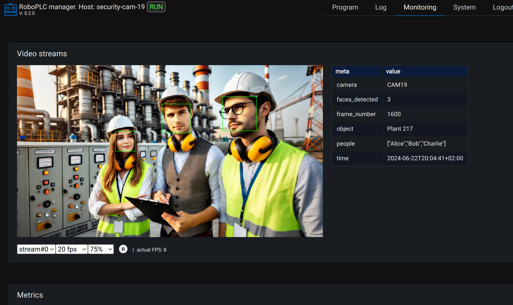

Video streams
*************

RoboPLC re-exports `RVideo <https://docs.rs/rvideo/>`_ crate which is
recommended to expose video streams from the program.

.. note::

   To work with video streams, enable roboplc crate **rvideo** feature.

Working with video streams
==========================

For computer-vision applications is always important to debug internal video
streams. The stream images may be captured, converted into different formats,
resized, cropped, altered etc. and it is important to check at all points that
the picture is correct.

RVideo provides a simple way to expose video streams from the program, as
similar as exposing :doc:`data metrics <metrics>`. No any special interface is
required, the defined video streams can be previewed either with `rvideo-view
<https://crates.io/crates/rvideo-view>`_ or with :ref:`roboplc_manager`.

Example:

.. code:: rust

   use roboplc::controller::prelude::*;
   use roboplc::{prelude::*, rvideo};
   use serde::Serialize;

   // ...

   // RVideo metadata structure, required if frames must have meta-data
   #[derive(Serialize)]
   struct Meta {
       // Required to preview bounding boxes in rvideo-compatible viewers
       #[serde(rename = ".bboxes")]
       bboxes: Vec<rvideo::BoundingBox>,
       frame_number: usize,
   }

   #[derive(WorkerOpts)]
   #[worker_opts(cpu = 3, priority = 50, scheduling = "fifo", blocking = true)]
   struct Detector {
       stream: rvideo::Stream,
       // ...
   }

   impl Worker<Message, Variables> for Detector {
       fn run(&mut self, _context: &Context<Message, Variables>) -> WResult {
           let mut frame_number = 1;
           // consider the source provides 720p RGB images as raw RGB8 vectors
           for img in get_images_from_some_source() {
               // optionally, obtain some bounding boxes, convert to
               // `rvideo::BoundingBox` if necessary
               let bboxes = detect_something(&img);
               let meta_packed: Arc<Vec<u8>> = rmp_serde::to_vec_named(&Meta {
                   bboxes,
                   frame_number,
               })?
               .into();
               let frame = rvideo::Frame::new_with_metadata(
                   meta_packed,
                   img.into(),
               );
               self.stream.send_frame(frame)?;
               frame_number += 1;
           }
           Ok(())
       }
   }

   // A "server" worker, which runs the default rvideo server
   #[derive(WorkerOpts)]
   #[worker_opts(cpu = 2, priority = 50, scheduling = "fifo", blocking = true)]
   struct RvideoSrv {}

   impl Worker<Message, Variables> for RvideoSrv {
       fn run(&mut self, _context: &Context<Message, Variables>) -> WResult {
           roboplc::serve_rvideo().map_err(Into::into)
       }
   }

   fn main() -> Result<(), Box<dyn std::error::Error>> {
       // ...
       let stream = rvideo::add_stream(rvideo::Format::Rgb8, 1280, 720)?;
       controller.spawn_worker(RvideoSrv {})?;
       controller.spawn_worker(Detector { stream })?;
       // ...
   }

Refer to the `RVideo documentation <https://docs.rs/rvideo/>`_ for more details.

Viewing streams with RoboPLC manager
====================================

If :ref:`roboplc_manager` is used, the metrics can be viewed in its interface.
RVideo server must listen at the TCP port *localhost:3001*.

