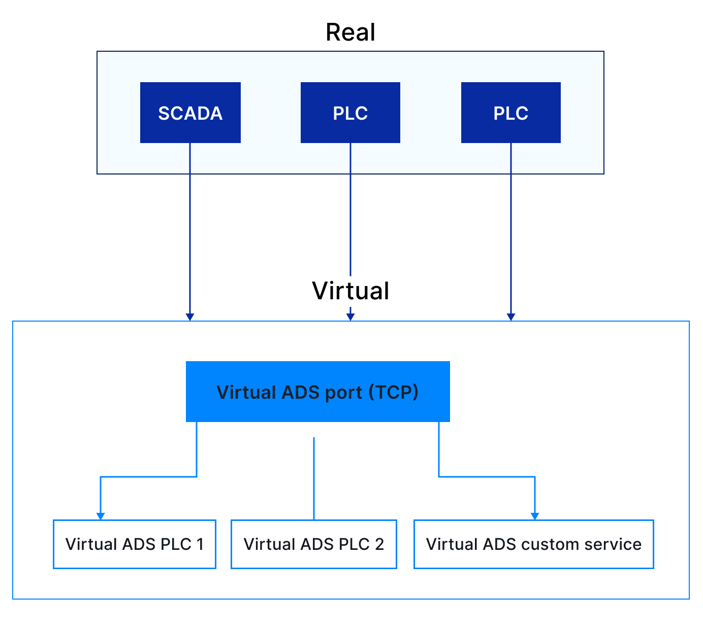

TwinCAT/ADS
***********

Virtual Fieldbus Simulator can simulate TwinCAT/ADS ports and services. In
virtual ADS the port (entry point) and all AMS services are simulated by
independent EVA ICS deployed services.

.. toctree::
    :caption: Virtual TwinCAT/ADS documentation
    :maxdepth: 1

    port
    service

Supported features and limitations
==================================

EVA ICS Virtual Fieldbus Simulator ADS service is the most complete TwinCAT 3
ADS simulation on the market which can be used for various testing and studying
scenarios such as automated CI/CD.

* The majority of ADS types are supported

* Arrays, including ranges, are supported in the same way as in real TwinCAT 3

* Most of ADS commands are supported, including SUM read/write/read-write.

* ADS services try to fully emulate ADS context, including variable information
  tables etc.

Limitations:

* Notifications are not supported

* Complex structures are not supported, meaning *MAIN.struct.var1* and
  *MAIN.struct.var2* are two different variables.

* Arrays of structures are not supported, meaning *MAIN.struct[0].var1* and
  *MAIN.struct[1].var1* are two different variables. Consider adding both.

* AMS routing to client side is not supported. This can be considered as a
  feature, as virtual ADS ports allow multiple applications to connect from the
  same host. Keep in mind that in production the applications must respect the
  real AMS routing requirements.

.. note::

   TwinCAT is the registered trademark of Beckhoff Automation GmbH. Virtual
   Fieldbus Simulator can not be used as a real TwinCAT replacement and is not
   designed to use in productional tasks.
