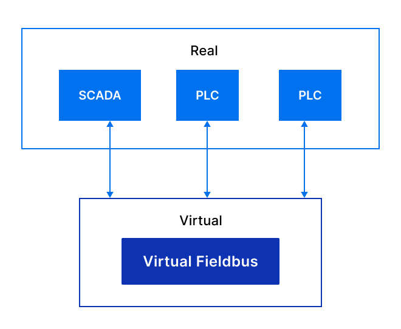

Virtual Fieldbus Simulator
**************************

EVA ICS Virtual Fieldbus Simulator is a pack of services which can simulate a
virtual fieldbus on any :doc:`EVA ICS v4<../eva4/index>` node.

The source code is available at https://github.com/eva-ics/sim

Currently Virtual Fieldbus Simulator supports Modbus simulation only.

EVA ICS can combine both Virtual Fieldbus Simulator and SCADA services on the
same machine, however there are no internal bus methods for SCADA services to
directly synchronize data with the virtual fieldbus.

To connect to a virtual fieldbus, the standard services must be used (e.g. 
Modbus: :doc:`../eva4/svc/eva-controller-modbus`) as any software/hardware acts
with virtual fieldbus as with a real one.

Certain virtual services may provide internal bus methods for fieldbus data
visualization which can be accessed by :doc:`../eva4/eapi`
applications/services or via :doc:`../eva4/svc/eva-hmi` as
*bus::<SVC>::<METHOD>* HTTP API methods.

.. toctree::
    :caption: Virtual Fieldbus Simulator documentation
    :maxdepth: 1

    install
    modbus/index
