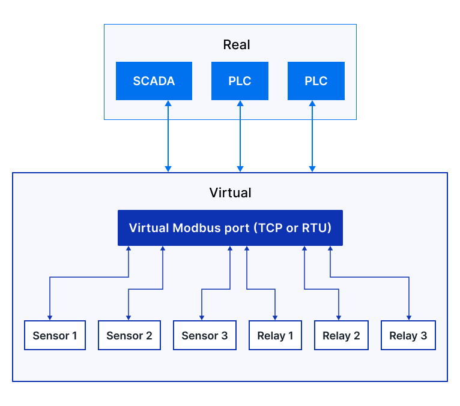

Modbus
******

Virtual Fieldbus Simulator can simulate Modbus ports and devices. In virtual
Modbus the port (entry point) and all connected devices are simulated by
independent EVA ICS deployed services.

.. toctree::
    :caption: Virtual Modbus documentation
    :maxdepth: 1

    port
    generic
    sensor
    relay
